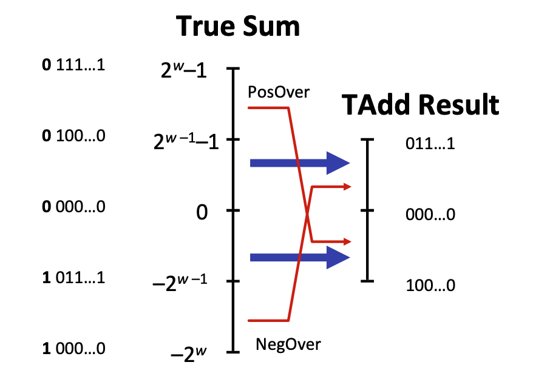
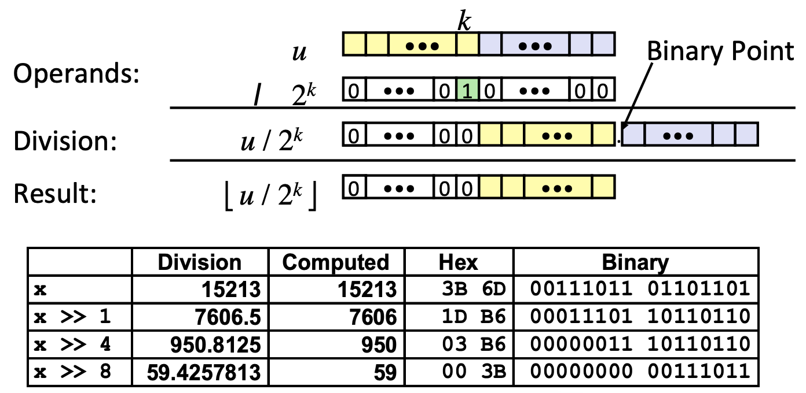
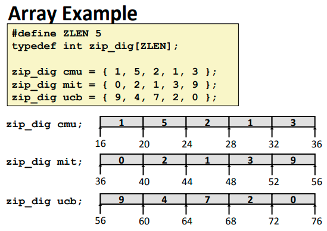
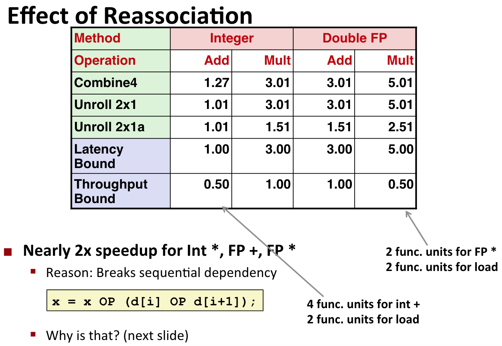
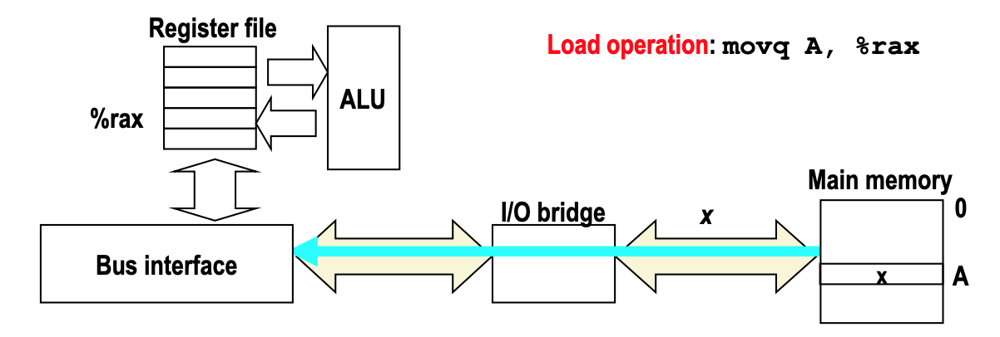
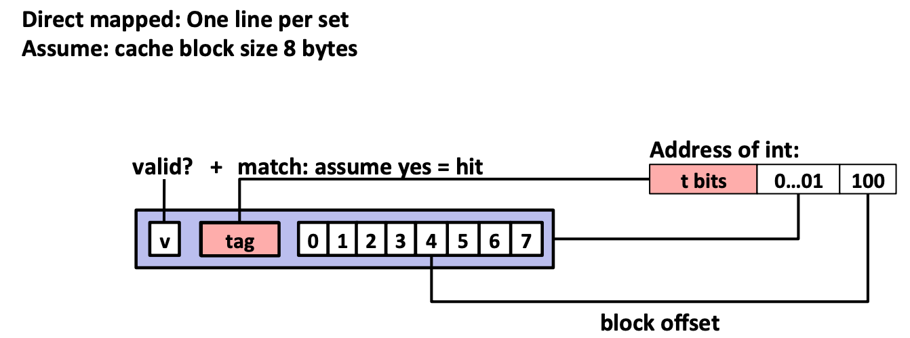

# Notes of CMU - Intro to Computer Systems

## 1 Bits, Bytes, and Ints

What we want to understand is what is the bit level representation of numbers. And how does that affect some of the properties you have when you operate then on, and especially looking at the corner cases when things overflow. We sort of don't do what, you might expect them to do.

### 1.1 Representing information as bits

### 1.1.1 Everything is bits

- **Each bit is 0 or 1**
- **By encoding/interpreting sets of bits in various ways**
  - Computers determine what to do (instructions)
  - ...and represent and manipulate numbers, sets, strings, etc...
- **Why bits? Eletronic Inplementation**
  - Easy to store with bitstable elements
  - Reliably transmitted on noisy and inaccurate wires


The reason why bits are great is in the digital world we can sort of take what otherwise an analog signal and quantify it. And just say I'm going to say that one range of values.

Let's say it's low voltage - I'm going to call that a $0$. And the high range of value I'm going to call it a $1$. If there is noise or imperfections in the circuit or anything going on, as long as that doesn't exceed these bit's threshold you've set up. Then you'll get a nice clean signal out of it.

### 1.1.2 For example, can count in binary

That's sort of at the core why everything we do, and especially for storing information, it turns out it's much easier to store one bit of information or a digital value than it is to store an analog value.

- **Base 2 Number Representation**
  - Represent $15213_{10}$ as $11101101101101_{2}$
  - Represent $1.20_{10}$ as $1.0011001100110010[0011]_{...2}$
  - Represent $1.5213 \times 10^4$ as $1.1101101101101_{2} \times 2^{13}$

When we do floating-point numbers where what you do is to the right of the binary point - not a decimal point:

$2^{1} 2^{0}$ . $2^{-1} 2^{-2}$

Something to the left of that would have a weight $2^0$, and the next one over would have weight $2^{1}$. But what you do is as you go to the right that adds weight $2^{-1}$ and $2^{-2}$. In otherwords they are $1 \over 2$ and $1 \over 4$.

So we can represent just like you do the decimal representation of fractions. We can do the binary representation of fractions. That's the core of floating point number of representations.

#### 1.1.3 Encoding Byte Values

It gets very annoying if you have say 32 or even 64-bit numbers to be writing the strings 1 and 0 out. So what we use and what's become largely the most common is to group collections of 4 bits at a time into. And then represent that in base 16 or what's known as hexadecimal representation. Using the letters $A$ through $F$ as values $10$ through $15$.

| **Hex** | **Decimal** | **Binary** |
| :-----: | :---------: | :--------: |
|    0    |      0      |    0000    |
|    1    |      1      |    0001    |
|    2    |      2      |    0010    |
|    3    |      3      |    0011    |
|    4    |      4      |    0100    |
|    5    |      5      |    0101    |
|    6    |      6      |    0110    |
|    7    |      7      |    0111    |
|    8    |      8      |    1000    |
|    9    |      9      |    1001    |
|    A    |     10      |    1010    |
|    B    |     11      |    1011    |
|    C    |     12      |    1100    |
|    D    |     13      |    1101    |
|    E    |     14      |    1110    |
|    F    |     15      |    1111    |

- **Byte = 8 bits**
  - Binary &00000000*{2}& to &1111111*{2}&
  - Decimal: $0_{10}$ to $255_{10}$
  - Hexadecimal $00_{16}$ to $FF_{16}$
    - Base 16 numbers representation
    - Use characters $0$ to $9$ and $A$ to $F$
      - $0xFA1D37B$
      - $0xfa1d37b$

#### 1.1.4 Example Data Representations

| C Data Type | Typical 32-bit | Typical 64-bit | x86-64 |
| :---------- | :------------: | :------------: | :----: |
| char        |       1        |       1        |   1    |
| short       |       2        |       2        |   2    |
| int         |       4        |       4        |   4    |
| long        |       4        |       8        |   8    |
| float       |       4        |       4        |   4    |
| double      |       4        |       8        |   8    |
| long double |       -        |       -        | 10/16  |
| pointer     |       4        |       8        |   8    |

There's also a slightly obscure holdover from ancient days of floating point. Where there's a special representation in Intel machines that use a 10 bytes or 80 bit representation. And when you use that on a 64-bit machine they sort of waste an extra 6 bytes out of that. So that everything is aligned in 16 byte increment.

The other thing and this is an important feature is any address is defined to be the word size of the machine. When they say it's a 64-bit machine, what they really mean is that the addresses are 64-bit values or 8-byte values.

### 1.2 Bit-level manipulations

#### 1.2.1 Boolean Algebra

- **Developed by George Boole in 19th Century**

  - Algebraic representation of logic
    - Encode "True" as 1 and "False" as 0

- **And**

  - **A&B = 1 when both A = 1 and B = 1**
    |&|0|1|
    |-|-|-|
    |0|0|0|
    |1|0|1|

- **Or**

  - **A|B = 1 when either A = 1 or B = 1**
    |\||0|1|
    |-|-|-|
    |0|0|0|
    |1|1|1|

- **Not**

  - **~A = 1 when A = 0**
    |~|0|
    |-|-|
    |0|1|
    |1|0|

- **Exclusive-Or (Xor)**
  - **A^B = 1 when either A = 1 or B = 1, but not both**
    |^|0|1|
    |-|-|-|
    |0|0|1|
    |1|1|0|

#### 1.2.2 General Boolean Algebras

- **Operate on Bit Vectors**

  - Operations applied bitwise

    |     | 01101001 |
    | --- | -------- |
    | &   | 01010101 |
    |     | 01000001 |

    |     | 01101001 |
    | --- | -------- |
    | \|  | 01010101 |
    |     | 01111101 |

    |     | 01101001 |
    | --- | -------- |
    | ^   | 01010101 |
    |     | 00111100 |

    | ~   | 01010101 |
    | --- | -------- |
    |     | 10101010 |

- **All of the Properties of Boolean Algebra Apply**
  So again we will spend a lot of time making use of the fact that in C. And this is one of the features to C that people like, is that you can do these sort of very low level of bit manipulations directly in the language.

#### 1.2.3 Example: Representing & Manipulating Sets

- **Representation**

  - Width w bit vector represents subset of {0, 1, ..., w-1}
  - **$\alpha_{j}=1$ if $j\owns A$**

    - 01101001 {0,3,5,6}
    - _7<span style="color:DarkRed">65</span>4<span style="color:DarkRed">3</span>21<span style="color:DarkRed">0</span>_

    - 01010101 {0,2,4,6}
    - _7<span style="color:DarkRed">6</span>5<span style="color:DarkRed">4</span>3<span style="color:DarkRed">2</span>1<span style="color:DarkRed">0</span>_

This example is an imagine we want to represent sets. Where the elements of the set are numbers ranging between 0 and 7. So 1 byte is enought to capture eight cases.

We'll just number the bits from right to left. This bit 0 would represent whether or not the value 0 is the element of the set.

- **Operations**

| Sign | Meaning              | Result of Bits | Result of Set      |
| ---- | -------------------- | -------------- | ------------------ |
| &    | Inersetion           | 01000001       | {0, 6}             |
| \|   | Union                | 01111101       | {0, 2, 3, 4, 5, 6} |
| ^    | Symmetric difference | 00111100       | {2, 3, 4, 5}       |
| ~    | Complement           | 10101010       | {1, 3, 5, 7}       |

These are actaully very common, for example, there are operations at a file I/O. About I/A that you can track which set of possible inputs to the system. Think of different network connections have an input ready for me to read.

And there is a data structure that is sort fo hidden away among some C library calls. But it basically is using exactly this representation about a thousand.

#### 1.2.4 Bit-Level Operations in C

A bits worth of information to represent these sets. And do manipulation on those sets so this is a very common and why do we use representation of sets in computer science.

- **Operations &, |, ~, ^ Available in C**
  - Apply to any "integral" data type
    - long, int, short, char, unsigned
  - View arguments as bit vectors
  - Arguments applied bit-wise
- **Examples (char data type)**
  - ~0x41 -> 0xBE
    - ~01000001 -> 10111110
  - ~0x00 -> 0xFF
    - ~00000000 -> 11111111
  - 0x69 & 0x55 -> 0x41
    - 01101001 & 01010101 -> 01000001
  - 0x69 | 0x55 -> 0x7D
    - 01101001 | 01010101 -> 01111101

#### 1.2.5 Contrast: Logic Operations in C

- Contrast to Logical Operations
  - &&, ||, !
    - View 0 as "False"
    - Anything nonzero as "True"
    - Always return 0 or 1
    - <span style="color:#C70039">Early termination</span>
- **Examples (char data tye)**
  - !0x41 -> 0x00
  - !0x00 -> 0x01
  - !!0x41 -> 0x01
  - <br>
  - 0x69 && 0x55 -> 0x01
  - 0x69 || 0x55 -> 0x01
  - p && \*p (avoids null pointer access)

One thing that's really important and that programmers screw it up all the time. It's to mix up the & and &&, or the | and ||. There is sort of a syntactic similarity, and there is actually somewhat of a semantic relation too.

In particularly this early termination is something that people use a lot, if you want to make sure that you're not accessing a null pointer, you can test whether that's null pointer first before accessing it. If _`p && \*p`_ is 0 or null, then it will do the dereferencing of null.

#### 1.2.6 Shift Operations

There is a curious feature that left shifts are always the same, but there are two different flavors of the right shift.

- **Left Shift: x << y**

  - Shift bit-vector **x** left **y** positions
    - Throw away extra bits on left
    - Fill with 0's on right
      |**Argument x**|01100010|
      |-|-|
      |**<< 3**|00010*000*|
      |**Log. >> 2**|*00*011000|
      |**Arith. >> 2**|*00*011000|

- **Right Shift: x >> y**

  - Shift bit-vector **x** right **y** positions
    - Throw away extra bits on right
  - Logical Shift
    - Fill with 0's on left
  - Arithmetic shift
    - Replicate most significant bit on left
      |**Argument x**|10100010|
      |-|-|
      |**<< 3**|00010*000*|
      |**Log. >> 2**|*00*01000|
      |**Arith. >> 2**|*11*011000|

- Undefined Behavior
  - Shift amount < 0 or ≥ word size

What should happen if I want to shift an 8-bit number 8 positions to the left: x << 8?

On most machines you'll get whatever x was, but not zero! Because what will do is it will compute this number mod(8). And the reason that happens is if you think about it, it's looking at just the lower two three bits of the shift amount and ignoring all the rest. So that's effectively like mod(8).

### 1.3 Integers

#### 1.3.1 Representation: unsigned and signed

##### 1.3.1.1 Encoding Integers


**A Simple Example of Unsigned Case:**

| 4   | 3   | 2   | 1   | 0   | w     |
| --- | --- | --- | --- | --- | ----- |
| 16  | 8   | 4   | 2   | 1   | $2^w$ |
| 1   | 0   | 1   | 1   | 0   | x     |

Result: 16 + 4 + 2 = 22

**A Simple Example of Signed Case:**

| 4   | 3   | 2   | 1   | 0   | w     |
| --- | --- | --- | --- | --- | ----- |
| -16 | 8   | 4   | 2   | 1   | $2^w$ |
| 1   | 0   | 1   | 1   | 0   | x     |

Result: -16 + 4 + 2 = -10

- **C short 2 bytes long**

|     | Decimal | Hex   | Binary            |
| --- | ------- | ----- | ----------------- |
| x   | 15213   | 3B 6D | 00111011 01101101 |
| y   | -15213  | C4 93 | 11000100 10010011 |

- **Sign Bit**
  - For 2's complement, most significant bit indicates sign
    - 0 for nonnegative
    - 1 for negative

##### 1.3.1.2 Numeric Ranges

- **Unsigned Values**

  - _UMin_ = 0, 000...0
  - _UMax_ = $2^w$ - 1, 111...1

- **Two's Complement Values**

  - _TMin_ = -$2^{w-1}$, 100...0
  - _TMax_ = $2^{w-1}$ - 1, 011...0

- **Other Values**
  - Minus 1, 111...1

**Values for _W_ = 16**

|      | Decimal | Hex   | Binary            |
| ---- | ------- | ----- | ----------------- |
| UMax | 65535   | FF FF | 11111111 11111111 |
| TMax | 32767   | 7F FF | 01111111 11111111 |
| TMin | -32768  | 80 00 | 10000000 00000000 |
| -1   | -1      | FF FF | 11111111 11111111 |
| 0    | 0       | 00 00 | 00000000 00000000 |

##### 1.3.1.3 Values for Different Word Sizes

These numbers call UMax the biggest unsigned number, TMin the smallest most negative two's complement number, and TMax the largest positive two's complement number.

|          | **8** | **16**  | **32**         | **64**                     |
| -------- | ----- | ------- | -------------- | -------------------------- |
| **UMax** | 255   | 65,535  | 4,294,967,295  | 18,446,744,073,709,551,615 |
| **TMax** | 127   | 32,767  | 2,147,483,647  | 9,223,372,036,854,775,807  |
| **TMin** | -128  | -32,768 | -2,147,483,648 | -9,223,372,036,854,775,808 |

- **Observations**

  - |_TMin_| = _TMax_ + 1
    - Asymmetric range
  - _UMax_ = 2 \* _TMax_ + 1

- **C Programming**
  - #include <limits.h>
  - Declares constans, e.g.,
    - ULONG_MAX
    - LONG_MAX
    - LONG_MIN
  - Values platform specific

##### 1.3.1.4 Unsgined & Signed Numeric Values

- Equivalence
  - Same encodings for nonnegative values
- Uniqueness
  - Every bit pattern represents unique integer value
  - Each representable integer has unique bit encoding
- Can Invert Mappings
  - U2B(x) = B2U$^{-1}$(_x_)
    - Bit pattern for unsigned integer
  - T2B(x) = B2T$^{-1}$(_x_)
    - Bit pattern for two's complement

#### 1.3.2 Conversion, casting

##### 1.3.2.1 Mapping Between Signed & Unsigned


- **Mappings between unsigned and two's complement numbers: <span style="color:#C70039">Keep bit representations and reinterpret</span>**


##### 1.3.2.2 Conversion Visualized

- **2's Comp. -> Unsigned**
  - Ordering Inversion
  - Negative -> Bit Positive


##### 1.3.2.3 Signed vs. Unsigned in C

- **Constants**
  - By default are considered to be signed integers
  - Unsigned if have "U" as suffix
    - 0U, 4354223U
- **Casting**
  - Explicit casting between signed & unsigned same as U2T and T2U

```c
int tx, ty;
unsigned ux, uy;
tx = (int) ux;
uy = (unsigned) ty;
```

- Implicit casting also occurs via assignments and procedure calls

```c
tx = ux;
uy = ty;
```

##### 1.3.2.4 Casting Surprises

- **Expression Evaluation**
  - If there is a mix of unsigned and signed in single expression, **_<span style="color:#C70039">signed values implicitly cast to unsigned</span>_**
  - Includeing comparision operations <, >, ==, <=, >=
  - Examples fow _W_ = 32:
    - TMIN = -2,147,483,648
    - TMAX = 2,147,483,647

| Constant$_{1}$ | Constant$_{2}$        | Relation | Evaluation |
| -------------- | --------------------- | -------- | ---------- |
| 0              | 0U                    | ==       | unsigned   |
| -1             | 0                     | <        | signed     |
| -1             | 0U                    | >        | unsigned   |
| 2,147,483,647  | -2,147,483,647 - 1    | >        | signed     |
| 2,147,483,647U | -2,147,483,647 - 1    | <        | unsigned   |
| -1             | -2                    | >        | signed     |
| (unsigned)-1   | -2                    | <        | unsigned   |
| 2,147,483,647  | 2,147,483,648(U)      | <        | unsigned   |
| 2,147,483,647  | (int)2,147,483,648(U) | >        | signed     |

##### 1.3.2.5 Summary Casting Signed <-> Unsigned: Basic Rules

- **Bit pattern is maintained**
- **But reinterpreted**
- **Can have unexpected effects: adding or subtracting 2$^w$**
- **Expression containing signed and unsigned int**
  - int is cast to unsigned!!!

```c
for (int i = n-1; i >= 0; i--)
  function(i);
```

Here's an interesting question what if we were declared as being unsigned?

```c
for (unsigned i = n-1; i >= 0; i--)
  function(i);
```

The loop will go forever!!! What would most likely happen is we would go from being 0 to being UMax. And that's really big number and the way we'd most likely cause a memory fault because it's so far out of bounds.

```c
for (int i = n-1; i - sizeof(char) >= 0; i--)
  function(i);
```

So _sizeof()_ returns an unsigned value, it's not actually a function, it's built in but it's the result of sizeof is considered to being unsigned.

If you have a signed value in it unsigned in any kind of arithmetic, it will turn treat the combination of the two is unsigned. So it will actually do an unsigned comparison here.

#### 1.3.3 Expanding, truncating

##### 1.3.3.1 Sign Extension

- **Task:**
  - Given _w_-bit signed integer _x_
  - Convert it to _w+k_-bit integer with same value
- **Rule:**
  - Make _k_ copies of sign bit:
  - X' = (x$_{w-1}$, ..., x$_{w-1}$), x$_{w-1}$, x$_{w-2}$, ..., x$_{0}$
    - () -> k copies of MB


**Simple Example:**

| Extented | Original | Value                  |
| -------- | -------- | ---------------------- |
|          | 1110     | -8+4+2 = -2            |
| 1        | 1110     | -16+8+4+2 = -2         |
| 1111     | 1110     | -128+64+...+8+4+2 = -2 |

That's the idea of sign extension and you'll see that a lot in bit patterns. Especially if you see a bit pattern with it starts with a bunch of F's, that tells you the number is negative.

##### 1.3.3.2 Sign Extension Example

```c
short int x = 15213;
int ix = (int) x;
short int y = -15213;
int iy = (int) y;
```

|     | Decimal |         Hex |                              Binary |
| --- | ------: | ----------: | ----------------------------------: |
| x   |   15213 |       3B 6D |                   00111011 01101101 |
| ix  |   15213 | 00 00 3B 6D | 00000000 00000000 00111011 01101101 |
| y   |  -15213 |             |                   11000100 10010011 |
| iy  |  -15213 |             | 11111111 11111111 11000100 10010011 |

- **Converting from smaller to larger integer data type**
- **C automatically performs sign extension**

##### 1.3.3.3 Truncating

|          | Truncated | Base | Value                |
| -------- | --------- | ---- | -------------------- |
| unsinged | 1         | 0101 | 16+4+1 = 21          |
| unsinged | Dropped   | 0101 | 4+1 = 5 = 21_mod(16) |
| singed   | 1         | 0101 | -16+4+1 = -11        |
| singed   | Dropped   | 0101 | 4+1 = 5 = ???        |

##### 1.3.3.4 Summary: Expanding, truncating: Basic Rules

- **Expanding (e.g., short int to int)**

  - Unsigned: zeros added
  - Signed: sign extension
  - Both yield expected result

- Truncating (e.g., unsigned to unsigned short)
  - Unsigned/signed: bits are truncated
  - Result are reinterpreted
  - Unsigned: mode operation
  - Signed: similar to mod
  - For small numbers yield expected behavior

#### 1.3.4 Addtion, negation, multipliation, shifting

##### 1.3.4.1 Unsigned Addition


If you take two numbers that range between up to the maximum value of an unsigned number, and then add then. That in principle you might need to get an extra bit to represent that sum.

Unfortunately we can't just go out and add more bits to your computer indefinitely. So we just stop it at some point and say, well, whatever bit happened to be in that sort of next bit position. We're just goig to drop it and pretend it doesn't exist. And say that the result of addition is just whatever the _w_ bit pattern you get if you only consider the first _w_ bits out of it. With no warning no message no error or anything, thi is just it happens silenty.

- Standard Addition Function
  - Ignores carry output
- Implements Modular Arithmetic
  - s = UAdd$_{w}$(_u_, _v_) = _u_ + _v_ mod 2$^w$

| Dropped | Original | Value                         |
| ------- | -------- | ----------------------------- |
|         | 0101     | 4+1 = 5                       |
|         | 1101     | 8+4+1 = 13                    |
| 1       | 0010     | 5+13 mod 2$^4$ = 18 mod16 = 2 |

##### 1.3.4.2 Visulizing (Mathematical) Integer Addition

- **Integer Addtion**
  - 4-bit integers _u_, _v_
  - Compute true sum Add$_{4}$(_u_, _v_)
  - Values increase linearly with _u_ and _v_
  - Forms planer surface


What we'll do is dropping that most significant bit, sort of create a cliff that when you roll over from 15 to 16 instead of it drops all the way down to 0. And that's referred to as an overflow.


##### 1.3.4.3 Two;s Complement Addition


- **TAdd and UAdd have identical bit-level behavior**
  - Signed vs. unsigned addition in C:

```c
int s, t, u, v;
s = (int) ((unsigned) u + (unsigned) v);
t = u + v;
```

Two's complement addition looks just like a regular edition. In other words, we can perform a subtraction. And addition of subtraction of numbers by using this two's complement representation for negative numbers.

- Will give s == t

| Dropped | Original | Value       |
| ------- | -------- | ----------- |
|         | 0101     | 4+1 = 5     |
|         | 1101     | -8+4+1 = -3 |
| 1       | 0010     | 5-3 = 2     |

| Dropped | Original | Value             |
| ------- | -------- | ----------------- |
|         | 1011     | -8+2+1 = -5       |
|         | 0011     | 2+1 = 3           |
|         | 1110     | -5+3 = -8+4+2= -2 |

**Overflow examples:**

| Dropped | Original | Value        |
| ------- | -------- | ------------ |
|         | 1010     | -8+2 = -6    |
|         | 1101     | -8+4+1 = -3  |
| 1       | 0111     | 7 (overflow) |

It's become positive and that's referred to as a negative overflow. The reason of course is the number -9, but we can't represent it in a 4-bit two's complement number, so it overflowed. You'll notice that the +7 differs from -9 by 16.

| Dropped | Original | Value         |
| ------- | -------- | ------------- |
|         | 0111     | 4+2+1 = 7     |
|         | 0101     | 4+1 = 5       |
| 1       | 1100     | -4 (overflow) |

We've taken two positive numbers and added them together and gotten a negative result.

##### 1.3.4.4 TAdd Overflow

- **Functionality**
  - True sum requires _w_+1 bits
  - Drop off MSB
  - Treat remaining bits as 2's comp. integer



##### 1.3.4.5 Visulizing 2's Complement Addition

- **Values**
  - 4-bits two's comp.
  - Range from -8 to +7
- **Wraps Around**
  - If sum >= 2$^{w-1}$
    - Becomes negative
    - At most once
  - If sum < -2$^{w-1}$ - Becomes positive - At most once


##### 1.3.4.6 Multiplication

Multiplication is basically the same idea. In fact all the operation are the basically the same idea that if you can't represent it within the word size, you just take the lower _w_ bits.

So all these complicated solutions here are just ways or sayings, in principle if you take two _w_ bits numbers and multiply them together. You might need a result may require as much as 2*w* bits to represent.

Before addtion is _w_+1, multiplication you actually have to double, because you're potentially squaring the largest number.

- **Goal: Computing Product of _w_-bit numbers _x, y_**
  - Either signed or unsigned
- **But, exact results can be bigger than _w_ bits**

  - Unsigned: up to 2w bits
    - Result range: 0 $\le$ _x_\*_y_ $\le$ (2$^w$ - 1)$^2$ = 2$^{2w}$ - 2$^{w+1}$ + 1
  - Two's complement min(negative): Up to 2*w*-1 bits
    - Result range: _x_\*_y_ $\ge$ (-2$^{w-1}$\*2$^{w-1}$-1) = -2$^{2w-2}$ + 2$^{w-1}$
  - Two's complement max(positive): Up to 2*w* bits, but only for (_TMin_$_{w}$)$^2$
    - Result range: _x_\*_y_ $\le$ (-2$^{w-1}$)$^2$ = 2$^{2w-2}$

- **So, maintaining exact results...**
  - Would need to keep expanding word size with each product computed
  - Is done in software, if needed
    - e.g., by “arbitrary precision” arithmetic packages

##### 1.3.4.7 Unsigned Multiplication in C


- **Standard Multiplication Funciton**
  - Ignores high order _w_ bits
- **Implements Modular Arithmetic**
  - UMult$_{w}$(_u_, _v_) = _u_ - _v_ mod 2$^w$

| Dropped | Original | Value   |
| ------- | -------- | ------- |
|         | 0011     | 2+1 = 3 |
|         | 0101     | 4+1 = 5 |
|         | 1101     | 15      |

| Dropped | Original | Value         |
| ------- | -------- | ------------- |
|         | 0101     | 4+1 = 5       |
|         | 0101     | 4+1 = 5       |
| 1       | 1001     | 25 mod 16 = 9 |

##### 1.3.4.8 Signed Multiplication in C


- **Standard Multiplication Function**
  - Ignores high order _w_ bits
  - Some of which are different for signed vs. unsigned multiplication
  - Lower bits are the same

| Dropped | Original | Value        |
| ------- | -------- | ------------ |
|         | 0100     | 4            |
|         | 0101     | 4+1 = 5      |
| 1       | 0100     | 20 mod 16 =4 |

| Dropped | Original | Value     |
| ------- | -------- | --------- |
|         | 0101     | 4+1 = 5   |
|         | 0101     | 4+1 = 5   |
| 1       | 1001     | -8+1 = -7 |

##### 1.3.4.9 Power-of-2 Multiply with Shift

There's a trick for multiplying by a power-of-2, which is just to shift the number to the left. You'll often see that when you have in your code, we want to multiply some number by 4, you'll write it in your C code, if you look at the assembly code, you'll see that compiler generated is just says shift it by 2.

- **Operation**
  - **u << k gives u \* 2$^k$**
  - Both signed an unsgined

So when they're doing shifts where you might expect them to be doing multiplicaiton, the reason for that as an optimization is historically the multiplication instruction took a lot longer than a shift instruction.

Say one clock to do a shift, and it used to be like 11, 12, 13 clock cycles to do a multiplication. Nowadays like on computers, we use the shark machines it only takes three clock cycles to do multiplication, because they added a lot of hardware to do that. But three clock cycles is still more time than one.

So when you can get away with a shift, it's generally a better idea. And the compiler has its onw kind of judgement calls on when is it more efficient to substitute one up for another.


##### 1.3.4.10 Unsigned Power-of-2 Divide with Shift

- **Quotient of Unsigned by Power of 2**
  - **u >> k gives u / 2$^k$**
  - Uses logical shift

Then if you want to divide something by a power-of-2, you can shift it right by this in the same general idea. The only thing that becomes a little bit quirky is what if the number you have is not actually divisible by the power-of-2.

**Unsigned Example:**

- Complement with 0 - Logical Operations
- Result round to 0

| operands | Original | Droped | Value   |
| -------- | -------- | ------ | ------- |
|          | 0110     | 0      | 4+2 = 6 |
| >>       | 0011     | 1      | 2+1 = 3 |
| >>       | 0001     | 1      | 1       |

**Signed Example:**

- Complement with 1 - Arithmetic Operations (most machines)
- Result round to minus infinity -$\infty$



| operands | Original | Droped | Value         |
| -------- | -------- | ------ | ------------- |
|          | 1010     | 0      | -8+2 = -6     |
| >>       | 1101     | 0      | -8+4+1 = -3   |
| >>       | 1110     | 1      | -8+4+2 = -2   |
| >>       | 1111     | 1      | -8+4+2+1 = -1 |

#### 1.3.5 Summary

##### 1.3.5.1 Arithmetic: Basic Rules

- **Addition:**
  - Unsigned/signed: Normal addition followed by truncate, same operation on bit level
  - Unsigned: addition mod 2$^w$
    - Mathematical addtion + possible subtraction of 2$^w$
  - Signed: modified addition mod 2$^w$ (result in proper range)
    - Mathematical addition + possible addition or subtraction of 2$^w$
- **Multiplication:**
  - Unsigned/signed: Normal multiplication followed by truncate, same operation on bit level
  - Unsigned: multiplication mod 2$^w$
  - Signed: modified multiplication mod 2$^w$ (result in proper range)

##### 1.3.5.2 Why Should I Use Unsigned?

- **Don't use without understanding implications**

  - Easy to make mistakes

  ```c
  unsigned i;
  for (i = cnt-2; i >= 0; i--)
    a[i] += a[i+1];
  ```

  - Can be very subtle

  ```c
  #define DELTA sizeof(int)
  int i;
  for (i = CNT; i-DELTA >= 0; i-= DELTA)
    ...
  ```

- **_Do_ Use When Performing Modular Arithmetic**
  - Multiprecision arithmetic
- **_Do_ Use When Using Bits to Represent Sets**
  - Logical right shift, no sign extension

##### 1.3.5.3 Countig Down with Unsigned

- **Proper way to use unsigned as loop index**
  ```c
  unsigned i;
  for (i = cnt-2; i < cnt; i--)
    a[i] += a[i+1];
  ```
- **See Robert Seacord, _Secure Coding in C and C++_**

  - C Standard guarantees that unsigned addition will behave like modular arithmetic
    - 0 - 1 > _UMax_

- **Even beteer**
  ```c
  size_t i;
  for (i = cnt-2; i < cnt; i--)
    a[i] += a[i+1];
  ```
  - Data **size_t** defined as unsigned value with length = word size
  - Code will work even if cnt = _UMax_
  - What if _cnt_ is signed and <0 ?

### 1.4 Representations in memory, pointers and strings

#### 1.4.1 Byte-Oriented Memory Organization

The main point is when you are running program on a computer, from the programming perspective either, even not just as a C programmer. In your mind the memory is just this bit array of bytes. That's numbered from 0 up to some maximum number.


- **Programs refer to data by address**

  - Conceptually, envision it as a very large array of bytes
    - In reality, it's not, but can think of it that way
  - An address is like an index into that array
    - And, a pointer variable stores an address

- **Note: system provides private address spaces to each "process"**
  - Think of a process as a program being executed
  - So, a program can clobber its own data, but not that of others

#### 1.4.2 Machine Words

The hardware doesn't neccessarily define what the word size is, it's a combination of the hardware and the compiler that determines what is the word size being used in the particular program.

```sh
gcc -m32 example.c -o example_32bit
gcc -m64 example.c -o example_64bit
```

- **Any given computer has a "Word Size"**

  - Norminal size of integer-valued data

    - and of addresses

  - Until recently, most machines used 32 bits (4 bytes) as word size

    - Limites addresses to 4GB (2$^{32}$ bytes)

  - Increasingly, machines have 64-bit word size

    - Potentially, could have 18 PB (petabytes) of addressable memory
    - That's 18.4 x 10$^{15}$

  - Machines still support multiple data formats
    - Fractions or multiples of word size
    - Always integral number of bytes

#### 1.4.3 Word-Oriended Memory Orgranization

- **Address Specify Byte Locations**

  - Address of first byte in word
  - Addresses of successive words differ by 4 (32-bit) or 8 (64-bit)


We can see these 32-bit memory are on multiples of 4 if bit boundaries, and same the 64-bit words are on multiples of 8. Those are known as aligned words and will generally will see that the compiler works pretty hard to keep things aligned. Because the hardware runs more efficiently that way.

But the main point is that we can just take as many bytes and collect them together and call it a word for what word size we need.

#### 1.4.4 Example Data Representations

| C Data Type | Typical 32-bit | Typical 64-bit | x86-64 |
| :---------- | :------------: | :------------: | :----: |
| char        |       1        |       1        |   1    |
| short       |       2        |       2        |   2    |
| int         |       4        |       4        |   4    |
| long        |       4        |       8        |   8    |
| float       |       4        |       4        |   4    |
| double      |       4        |       8        |   8    |
| long double |       -        |       -        | 10/16  |
| pointer     |       4        |       8        |   8    |

#### 1.4.5 Byte Ordering

- **So, how are the bytes within a multi-byte word ordered in memory?**

- **Conventions**

  - Big Endian: Sun, PowerPC Mac, Internet
    - Least significatn byte has highest address
  - Littile Endian: x86, ARM processrs running Android, iOS, and Windows
    - Least significant byte has lowest address

- **Example**
  - Variable x has 4-byte value of 0x01234567
  - Address given by &x is 0x100


#### 1.4.6 Representing Integers


#### 1.4.7 Examining Data Representations

- **Code to Print Byte Representation of Data**
  - Casting pointer to unsigned char \* allows treatment as a byte array

```c
#include <stdio.h>
#include <stdlib.h>

// unsigned char -> general point type
typedef unsigned char *pointer;

void show_bytes(pointer start, size_t len)
{
    size_t i;
    for (i = 0; i < len; i++)
        // %p -> print pointer
        // %x: print hexadecimal
        printf("%p\t0x%.2x\n", start + i, start[i]);
    printf("\n");
}

int main(int argc, char **argv)
{
    int a = 15213;
    printf("int a = 15213; \n");
    show_bytes((pointer) &a, sizeof(int));

    return 0;
}
```

```sh
int a = 15213;
0x7ffeef79374c	0x6d
0x7ffeef79374d	0x3b
0x7ffeef79374e	0x00
0x7ffeef79374f	0x00
```

If you run this on a x86 machine, you see that there is these addresses with a lot of `7F`s. What that mean is it's in the upper end of this 47 bit address space.

#### 1.4.8 Representing Strings

- **Strings in C**
  - Represented by array of characters
  - Each character encoded in ASCII format
    - Standard 7-bit encoding of character seet
    - Character "0" has code 0x30
      - Digit _i_ has code 0x30+_i_
    - String should be null-terminated
      - Final character = 0
- **Compatibility**
  - Byte ordering not an issue

#### 1.4.9 Integer C Puzzles

**Initialization**

```c
int x = foo();
int y = bar();
unsigned ux = x;
unsigned uy = y;
```

- x < 0 => (x \* 2) < 0 => False for TMin
- ux >= 0
- x & 7 == 7 => (x << 30) < 0 => True
- ux > -1 => Always False
- x > y => -x < -y => False
- x \* x >= 0 => False
- x > 0 && y > 0 => x + y > 0
- x >= 0 => -x <= 0 => True
- x <=0 => -x >= 0 => False for Tmin
- (x|-x) >> 31 == -1 => True

## 2 Floating Point

### 2.1 Background: Fractional binary numbers

#### 2.1.1 Fractional binary numbers

- **What is 1101.101$_{2}$?**


- **Exmaples:**

| Value  | Representation |
| ------ | -------------- |
| 5 3/4  | 101.11         |
| 2 7/9  | 10.111         |
| 1 7/16 | 1.0111         |

- **Observations**
  - Divide by 2 by shifting right (unsigned)
  - Multiply by 2 by shifting left
  - Numbers of form 0.1111111.... are just below 1.0
    - 1/2 + 1/4 + 1/8 + ... + 1/2$^i$ + ... -> 1.0
    - Use notation 1.0 - $\epsilon$

#### 2.1.1 Representable Numbers

- **Limitation #1**

  - Can only exactly represent numbers of the form x/2$^k$
    - Other rational number have repeating bit representations

- **Exmaples:**

| Value | Representation         |
| ----- | ---------------------- |
| 1/3   | 0.01010101[01]...      |
| 1/5   | 0.001100110011[0011]   |
| 1/10  | 0.00011000110011[0011] |

- **Limitation #2**
  - Just one setting of binary point within the _w_ bits
    - Limited range of numbers (very small values? very large?)

### 2.2 IEEE floating point standard: Definition

#### 2.2.1 IEEE floating point standard

- **IEEE Standard 754**

  - Established in 1985 as uniform standard floating point arithmetic
    - Before that, many idiosyncratic formats
  - Supported by all major CPUs

- **Driven by numerical concerns**
  - Nice standards for rouding, overflow, underflow
  - Hard to make fast in hardware
    - Numerical analysts predominated over hardware designers is defining standard

#### 2.2.2 Floating Point Representation

- **Numerical Form:**
  **(-1)$^s$M2$^E$**

  - Sign bit **_s_** determines whether number is negative or positive
  - Significant **_M_** normally a fractional value in range [1.0, 2.0).
  - Exponent **_E_** weights value by power of two

- **Encoding**
  - MSB S is sign bit **_s_**
  - exp field encodes **_E_** (but is not equal to E)
  - frac field encodes **_M_** (but is not equal to M)


#### 2.2.3 Precision options


#### 2.2.4 "Normalized" Values

<span style="font-size:1.5em">**v = (-1)$^s$M2$^E$**</span>

- **When: exp != 000...0 and exp != 111...1**

- **Exponent coded as a biased value: E = Exp - Bias**

  - Exp: unsigned value of exp field
  - Bias = 2$^{k-1}$, when k is number of exponent bits
    - Single precision: 127 (Exp: 1...254, E: -126...127)
    - Double precision: 1023 (Exp: 1...2046, E: -1022...1023)

- **Significant coded with impplied leading 1: M = 1.xxx...x$_{2}$**
  - xxx...x: bits of frac field
  - Minimum when frac = 000.0 (M = 1.0)
  - Maximum when frac = 111.1 (M = 2.0 - $\epsilon$)

#### 2.2.5 Normalized Encoding Example

<span style="font-size:1.5em">**v = (-1)$^s$M2$^E$**</span><br>
<span style="font-size:1.5em">**E = Exp - Bias**</span>

- **Value: float F = 15213.0;**

  - 15213$_{10}$ = 11101101101101$_{2}$
  - = 1.1101101101101$_{2}$ x 2$^{13}$

- **Signficant**

  - M = 1.<ins>1101101101101</ins>$_{2}$
  - frac = <ins>1101101101101</ins>0000000000$_{2}$

- **Exponent**

  - E = 13
  - Bias = 127
  - Exp = 140 = 10001100$_{2}$

- **Result**


- **0 <= Exp <= 0111111 = 255**
- **-127 <= E <= 255-127 = 128**

#### 2.2.6 Denormalized Values

Now these normalized values always have this implied one, when we want to represent numbers closer to zero, that limits us. So there is another type of floating point number called the denormalized values.

- **Condtion: exp = 000...0**

- **Exponent value: E = 1 - Bias (instead of E = 0 - Bias)**
- **Significant coded with implied leading 0: M = 0.xxx...x$_{2}$**

  - xxx...x: bits of frac

- Cases
  - exp = 000...0, frac = 000...0
    - Represents zero value
    - Note distinct values: +0 ad -0 (why?)
  - exp = 0000...0, frac != 000...0
    - Numbers closest to 0.0
    - Equispaced

#### 2.2.7 Special Values

- **Condition: exp = 111...1**

- **Case: exp = 111...1, frac = 000...0**

  - Represents value $\infty$ (infinity)
  - Operation that overflows
  - Both positive and negative
  - E.g., 1.0/0.0 = -1.0/-0.0 = +$\infty$, 1.0/-0.0 = -$\infty$

- **Case: exp = 111...1, frac != 000...0**
  - Not-a-Number (NaN)
  - Represents case when no numeric value can be determined
  - E.g., sqrt(-1), $\infty$ - $\infty$, $\infty$ x 0

#### 2.2.7 Visualization: Floating Point Encoding


### 2.3 Example and properties

#### 2.3.1 Tiny Floating Point Example


- **8-bit Floating Point Representation**

  - the sign bit is in the most significant
  - the next four bits are the exponent, with a bias of 7
  - the last three bits are the **frac**

- **Same general form as IEEE Format**
  - normalized, denormalized
  - representation of 0, NaN, infinity


#### 2.3.2 Distribution of Values


You can see that the values are very dense around zero, so they've very spaced very closely together. And then every time you increase the exponent by one, the numbers are spaced twice as far apart as the previous, the numbers that were represented by the previous exponent.


#### 2.3.3 Special Properties of the IEEE Encoding

- **FP Zero Same as Integer Zero**

  - All bits = 0

- **Can (Almost) Use Unsigned Integer Comparison**
  - Must first compare sign bits
  - Must consider -0 = 0
  - NaNs problematic
    - Will be greater than any other values
    - What should comparison yield?
  - Otherwise OK
    - Denorm vs. normalized
    - Normalized vs. infinity

### 2.4 Rounding, addition, multiplication

#### 2.4.1 Floating Point Operations: Basic Idea

- **x + y = Round(x + y)**

- **x $\times$ y = Round(x $\times$ y)**

- Basic idea
  - Fisrt **compute exact result**
  - Make it fit into desired precision
    - Possibly overflow if exponent too large
    - Possibly **round to fit into** _frac_

#### 2.4.2 Rounding

- **Rounding Modes (illustrate with $ rounding)**

|                        | $1.40 | $1.60 | $1.50 | $2.50 | -$1.50 |
| ---------------------- | ----- | ----- | ----- | ----- | ------ |
| Towards zero           | $1    | $1    | $1    | $2    | -$1    |
| Round down (-$/infty$) | $1    | $1    | $1    | $2    | -$2    |
| Round up (+$/infty$)   | $2    | $2    | $2    | $3    | -$1    |
| Neraest Even (default) | $1    | $2    | $2    | $2    | -$2    |

#### 2.4.3 Closer Look at Rount-To-Even

- **Default Rounding Mode**

  - Hard to get any other kind without dropping into assembly
  - All others are statistically biased
    - Sum of set of positive numbers will consistenly be over- or under- estimated

- **Applying to Other Decimal Places / Bit Positions**
  - When exactly halfway between two possible values
    - Round so that least significant digit is even
  - E.g., round to nearest hundredth
    - 7.894999 7.89 (Less then half way)
    - 7.895001 7.90 (Greater then half way)
    - 7.895000 7.90 (Half way - round up)
    - 7.885000 7.88 (Half way - round down)

#### 2.4.4 Rounding Binary Numbers

- **Binary Fractional Numbers**

  - "Even" when least significant bit is 0
  - "Half way" when bits to right of rounding position = 100...$_{2}$

- **Examples**
  - Round to nearest 1/4 (2 bits right of binary point)

| Value  | Binary                    | Rounded     | Action        | Rounded Value |
| ------ | ------------------------- | ----------- | ------------- | ------------- |
| 2 3/32 | 10.00<ins>011</ins>$_{2}$ | 10.00$_{2}$ | (<1/2 - down) | 2             |
| 2 3/16 | 10.00<ins>110</ins>$_{2}$ | 10.01$_{2}$ | (>1/2 - up)   | 2 1/4         |
| 2 7/8  | 10.11<ins>100</ins>$_{2}$ | 11.00$_{2}$ | (1/2 - up)    | 3             |
| 2 5/8  | 10.10<ins>100</ins>$_{2}$ | 10.00$_{2}$ | (1/2 - down)  | 2 1/2         |

#### 2.4.5 Floating Point Multiplication

- <span style="color:DarkRed">**(-1)$^{s1}$ M1 2$^{E1}$ $\times$ (-1)$^{s2}$ M2 S$^{E2}$**</span>
- **Exact Result: <span style="color:DarkRed">(-1)$^{s}$ M1 2$^{E}$</span>**

  - Sign s: s1 ^ s2
  - Significant M: M1 $\times$ M2
  - Exponent E: E1 + E2

- **Fixing**

  - If M > 2, shift M rightm increment E
  - If E out of range, overflow
  - Round M to fit _frac_ precision

- **Implementation**
  - Biggest chore is multiplying significants

#### 2.4.6 Floating Point Addition

- <span style="color:DarkRed">**(-1)$^{s1}$ M1 2$^{E1}$ + (-1)$^{s2}$ M2 S$^{E2}$**</span>

  - Assume E1 > E2

- **Exact Result: <span style="color:DarkRed">(-1)$^{s}$ M1 2$^{E}$</span>**

  - Sign s, significant M:
    - Result of signed align & add
  - Exponenet E: E1


- **Fixing**
  - If M >= 2, shift M right, increment E
  - If M < 1, shift M left k positions, decrement E by k
  - Overflow if E out of range
  - Round M to fit _frac_ precision

#### 2.4.7 Mathematical Properties of Floating Point Add

Remember that those great realities that ints aren't really integers and floats aren't really reals. Just as we saw when we looked at two's complement representation integers, it's not exactly they're not exactly like real integers. And operations on them aren't exactly like real integers, but they follow very predictable mathematical properties. They are similar to integers, but not quite.

So the same thing holds for floating point numbers, they follow very predictable mathematical properties, but they're somewhat different from the reals.

- **Compare to those Abelian Group**

  

  - Closed under addition? **<span style="color:DarkRed">Yes<span>**
    - But may generate infinity or NaN
  - Commutative? **<span style="color:DarkRed">Yes<span>**

    _The big thing with addition is that it doesn;t associate, it's communtative but it's not associative._

  - Associative? **<span style="color:DarkRed">No<span>**
    - Overflow and inexactness of rounding
    - (3.14 + 1e$^{10}$) - 1e$^{10}$ = 0, 3.14 + (1e$^{10}$ - 1e$^{10}$) = 3.14
  - 0 is additive identity?
  - Every element has additive inverse? **<span style="color:DarkRed">Yes<span>**
    - Yes, except for infinities & NaNs **<span style="color:DarkRed">Almost<span>**

- **Monotonicity**
  - a >= b => a+c >= b+c? **<span style="color:DarkRed">Almost<span>**
    - Except for infinities & NaNs

#### 2.4.8 Mathematical Properties of Floating Point Multiplication

- **Compare to Commutative Ring**

  - Closed under multiplication? **<span style="color:DarkRed">Yes<span>**
    - But may generate infinity or NaN
  - Multiplication Commutative? **<span style="color:DarkRed">Yes<span>**
  - Multiplication is Associative? **<span style="color:DarkRed">No<span>**
    - Possibility of overflw, inexactness of rounding
    - (1e$^{20}$ _ 1e$^{20}$) _ 1e - 20 = inf, 1e$^{20}$ \* (1e$^{20}$ - 20) = 1e$^{20}$
  - 1 is multiplication identity? **<span style="color:DarkRed">Yes<span>**
  - Multiplication distributes over addition? **<span style="color:DarkRed">No<span>**
    - Possibility of overflow, inexactness of rounding
    - 1e$^{20}$ _ (1e$^{20}$ - 1e$^{20}$) = 0.0, 1e$^{20}$ _ 1e$^{20}$ - 1e$^{20}$ \* 1e$^{20}$ = NaN

- **Monotonicity**
  - a >= b => a\*c >= b\*c? **<span style="color:DarkRed">Almost<span>**
    - Except for infinities & NaNs

### 2.5 Floating point in C

- **C Guarantees Two Levels**

  - `float` single precision
  - `double` double precision

- Conversions/Casting

  - Casting between `int`, `float`, and `double` changes bit representation
  - `double`/`float` -> int
    - Truncates fractional part
    - Like rounding toward zero
    - Not defined when out of range or NaN: Generally sets to TMin
  - `int` -> `double`
    - Exact conversion, as long as `int` has <= 53 bit word size
  - `int` -> `float`
    - Will round according to rounding mode

- **Puzzles: For each of the following C expressions, either:**

  - Argue that it is ture for all argument values
  - Explain why not true

  Assume either `d` not `f` is `NaN`

  ```c
  #include <stdio.h>

  int main(int argc, char **argv)
  {
      int x = -8;
      float f = -444.444;
      double d = -88.88888;

      printf("x = %d, f = %f, d = %f\n", x, f, d);
      printf("x == (int)(float)x => %d\n", (x == (int)(float)x));
      printf("x == (int)(double)x => %d\n", (x == (int)(double)x));
      printf("f == (float)(double)f => %d\n", (f == (float)(double)f));
      printf("d == (double)(float)d => %d\n", (d == (double)(float)d));
      printf("f == -(-f) => %d\n", (f == -(-f)));
      printf("2/3 == 2/3.0 => %d\n", ((2/3) == (2/3.0)));
      printf("d > f => (-f > -d) => %d\n", (-f > -d));
      printf("d * d >= 0.0 => %d\n", (d * d >= 0.0));

      f = -1.54334E-34;
      d = -88.88888;
      printf("Changed f = %f, d = %f\n", f, d);
      printf("(d+f)-d == f => %d\n", ((d+f)-d == f));

      return 0;
  }
  ```

  Result:

  ```sh
  x = -8, f = -444.444000, d = -88.888880
  x == (int)(float)x => 1
  x == (int)(double)x => 1
  f == (float)(double)f => 1
  d == (double)(float)d => 0
  f == -(-f) => 1
  2/3 == 2/3.0 => 0
  d > f => (-f > -d) => 1
  d * d >= 0.0 => 1
  Changed f = -0.000000, d = -88.888880
  (d+f)-d == f => 0
  ```

## 3 Machine-Level Programming I: Basics

### 3.1 History of Intel processors and architectures

#### 3.1.1 Intel x86 Processors

The x86 is sort of a colloquial term for Intel processors. The reason is that the first one was called the 8086, and then they kind of skipped 81, but them they went to 8286 and so forth 8386. The one thing in common was 86,so people just call it x86.

One thing that's important to this and it will have influence on what the program look like is, x86 is a language like english. That's been an accrual and evoluton of different feature layered on top of each other, and not always in a elegant way. So just like english there's sort of quirky things ... it's a language that just got there, because of a bunch of decisions that locally were probably the right thing to do, but globaly were not.

There's other instruction sets that are much cleaner and easier to understand. But we figure it;s just the same reason that you learn english instead of leanring esperanto or something like that. That's a much more useful language.

- **Dominate laptop/desktop/server market**

- **Evolutionary design**

  - Backwards compatible up until 8086, introduced in 1978
  - Added more features as time goes on

- **Complex intructon set computere (CISC)**
  - Many different instructions with many different formats
    - But, only small subset encountered with Linux programs
  - Hard to match performance of Reduced Instruction Set Computers (RISC)
  - But, Intel has done just that!
    - In terms of speed. Less so for low power.

#### 3.1.2 Intel x86 Evolution: Milestones


- **Machine Evelution**
  

- **Added Features**
  - Instructions to support multimedia operations
  - Instructions to enable more efficient conditional operations
  - Transition from 32 bits to 64 bits
  - More cores

#### 3.1.3 2015 State of the Art

_If you describe something as state-of-the-art, you mean that it is the best available because it has been made using the most modern techniques and technology._

- **Core i7 Broadwell 2015**


#### 3.1.4 x86 Clones: Advanced Micro Devices (AMD)

- **Historically**

  - AMD has followed just behind Intel
  - A little bit slower, a lot cheaper

- **Then**
  - Recruited top circuit designers from Digita Equipment Corp. and other downward trending companies
  - Build Opteran: tough competitor to Pentium 4
  - Developed x86-64, their own extension to 64 bits
- **Recent Years**
  - Intel got its act together
    - Leads the world in semiconductor technology
  - AMD has fallen behind
    - Relies on external semiconductor manufaturer

#### 3.1.5 Intel's 64-Bit History

- **2001: Intel Attempts Radical Shift from IA32 to IA64**
  - Totally different architecture (Itanium)
  - Executes IA32 code only as legacy
  - Performance disapointing
- **2003: AMD Steps in with Evolutionary Solution**
  - x86-64 (now called "AMD64")
- **Intel Felt Obligated to Focus on IA64**
  - Hard to admit mistake or that AMD is better
- **2004: Intel Announces EM64T extension to IA32**
  - Extended Memory 64-bit Technology
  - Almost identical to x86-64!
- **All but low-end x86 processor support x86-64**
  - But, lots of code still runs in 32-bit mode

#### 3.1.6 ARM

ARM actually is an acronym for Acorn RISC Machine, RISC means reduced instruction set computer. An acorn means the seed of oak tree, it was a Britsh company that decided to make its own personal computers in the early days of it and they said "we are going to buy those chips from Intel, we're going to make them ourselves". So they designed and manufactured their own chips.

Well as a company a computer manufacturer it was a complete bust. But it turned out that they'd come up with a fairly good instruction set that was sufficiently simple that it could be put on chips and better yet it could be customized.

ARM is now a company of its own headquartered in Cambridge England, the reason why part of they're successful therefore is becuase it tends to be a lower power processor requirement than an x86 machine because it's simpler.

But the other is that they don't actually sell processors, they sell companies the rights the licensing rigts to use their designs. So if you look at like a cell phone processor the actual ARM processor is a little tiny of it on the chip. And they'll have other stuff to make the graphics go better to improve your phone calls and so forth.

So they're really selling what intellectual property is as opposed to chips.

### 3.2 C, assembly, machine code

#### 3.2.1 Definitions

- **<span style="color:DarkRed">Architecture:</span> (also ISA: Instruction Set Architecture) The parts of a proccessor design that one needs to understand or write assembly/machine code.**

  - Example: instruction set specification, registers.

- **<span style="color:DarkRed">Microarchitecture:</span> Implementation of the architecture.**

  - Examples: cache sizes and core frequency.

- **Code Forms:**
  - <span style="color:DarkRed">Machine Code:</span> The byte-level programs that a processor executes
  - <span style="color:DarkRed">Assembly Code:</span> A text representation of machine code
- **Example ISAs:**
  - Intel: x86, IA32, Itanium, x86-64
  - ARM: Used in almost all mobile phones

#### 3.2.2 Assembly/Machine Code View


From a programmer machine level programmer perspective, things are a bit different than you see when you write C code.

First of all there is some ver yvisible parts of the instruction the machine state, that you can examine and test and operate on and you must in fact. You would never know understand what those are if you're just thinking in terms of C.

In particular there's some sort of a program counter to tell you what address is the instruction that you're going to execute next and where is that located in memory.

Then there's a set of registers which are part of that the programmer actually makes use of. You can think of them as a very small number of memory locations, but rather than iving an address from 0 up to n-1 or something. You actaully give them by name as specifically.

There is another sort of state, that's just a few bits worth of state that talked about what are the results of some recent instructions, where they did it produce a value of 0, did it produce a negative or a positive value. And those are used to implement conditional branching.

So that's sort of the processor and then the other part of is the memory, that you can think of logically as just an array of bytes, that's what the machine level programmer sees.

It's actaully kind of a fiction in different way, there's sort of a collabration between the operating system and the hardware, what they all virtual memory to make it look each program running on the processor. Has its own independent array of bytes that it can access. Even though they actaully share values within the physical memory itself.

Further more, the idea of a cache is not visible here at all. Beacause it just is automatically loaded with recent stuff. The only thing that will look different is if you read access that memory, it will go faster. But it's mot visible in terms of there's no instructions to manipulate the cache. There's no way you can directly access the cache.

- **Programmer-Visible State**
  - **PC: Program counter**
    - Address of next instruction
    - Called "RIP" (x86-64)
  - **Register file**
    - Heavily used program data
  - **Condition codes**
    - Store status information about most recent arithmetic or logical operation
    - Used for condition branching
  - **Memory**
    - Byte addressable array
    - Code and user data
    - Stack to support precedures

#### 3.2.3 Turning C into Object Code


- Code in file **`p1.c`, `p2.c`**
- Compile with command: **`gcc -Og p1.c p2.c -o p`**
  - Use basic optimization (**`-Og`**) (New to recent versions of GCC)
  - Put resulting binary in file **`p`**

#### 3.2.4 Compiling Into Assembly

**C Code (sum.c)**

```c
long plus(long x, long y);

void sumstore(long x, long y, long *dest)
{
    long t = plus(x, y);
    *dest = t;
}
```

```sh
gcc -Og -S sum.c
```

**Produces file sum.s**

_<span style="color:DarkRed"> Warning: Will get very differnt results on different machines.</span>_

**Generated x86-64 Assembly on shark machine**

```asm
sumstore:
	pushq	%rbx
	movq	%rdx, %rbx
	call	plus
	movq	%rax, (%rbx)
	popq	%rbx
	ret
```

- Those `%` are the actual names of registers - remember that the registers are given by name.
- `pushq` means push something onto a stack.
- `move` means move copy it from one place to another.
- `call` means to call some procedure.
- `pop` is the counterpart to `push`.
- `ret` is exit return out of this particular function.

The **`-Og` ** is a specification of what kind of optimization we want the compiler to do. If you don't say anything - just don't give any directive, it will generate compeletely unoptimized code and it's actually very hard to read that code, it was very tedious the way it works.

If you say **`-O1`**, which is what people used to do to turn on the optimizer, it turns out tha as GCC as they've gotten more advanced, it does a lot of optimizations now. That for the purpose of this course make the code pretty hard to understand.

So just with one of the most recent generations of GCC came out with this level called **`g`** for debugging. Purpose of this course a nice level that sort of does the obvious kind of optimizations to make the code readable.

-> Check the actuall `sum.s` file...

The reason is there are various directives that aren't really directly part of the code itself. The fact they start with a period **`.`** is an indication that these aren't actaully instructions, they're something else. And they all are related to what the information that needs to be fed to a debugger, for it to be able to locate various parts of the program. And some information for the linker to tell it that this is globally defined function. And various other things that you don't really need to at least think about initially. So we sort of take those out the program just to make them more readable.

#### 3.2.5 Assembly Characteristics: Data Types

In integer data types, they don't distingush signed versus unsigned in how it gets stored. Even at an address or a pointer, is just stored as a number in a computer, and doesn't have any special significance to it.

A floating point is handled in a very differnt way, on the other hand with a different set of registers.

The program itself is in x86 it's just a series of bytes.

And things like arrays and structs you think of as fundamental datatypes don't exist in the machine level. They're sort of constructed artificially by the compiler.

- **"Integer" data of 1, 2, 4, or 8 bytes**

  - Data values
  - Addresses (untyped pointers)

- **Floating point data of 4, 8, or 10 bytes**

- **Code: Byte sequences encoding series of instructions**

- **No aggregate types such arrays or structures**
  - Just contiguously allocated bytes in memory

#### 3.2.6 Assembly Characteristics: Operations

- **Perforam arithmetic function on register or memory data**

- **Transfer data between memory and register**

  - Load data from memory into register
  - Store register data into memory

- **Transfer control**
  - Unconditional jumps to/from procedures
  - Conditional branches

#### 3.2.7 Object Code


#### 3.2.8 Machine Instruction Example

```c
*dest = t;
```

- **C Code**

  - Store value `t` where designated by `dest`

  What that will typically and not always but this sort of way to think about that at the machine level is.

  `T` or some local value would by typically store in a register.

```asm
movq %rax (%rbx)
```

- **Assembly**
  - Move 8-byte value t omemory
    - Quad words in 86-64 parlance
  - Operands:
    `t`: Register %rax
    `dest`: Register %rbx
    `_dest_: MemoryM[%rbx]

```s
0x400r59r: 48, 89, 03
```

- **Object Code**
  - 3-byte instruction
  - Stored at address 0x40059

#### 3.2.9 Dissembling Object Code

**Disassmembled**


- **Disassemble**

```sh
objdump -d sum
objdump -d sum > sum.d
```


- Useful tool for examining object code
- Analyzes bit pattern of series of instructions
- Produces approximate rendition of assembly code
- Can be run on either `a.out` (completed executable) or `.o` file

#### 3.2.10 Alternate Disassembly


#### 3.2.11 What can be Disassembled?


- **Anything that can be interpreted as exectuable code**
- **Disassembler examines bytes and reconstructs assembly source**

### 3.3 Assembly Basics: Registers, operands, move

#### 3.3.1 x86-64 Integer Registers


- Can reference low-order 4 bytes(also low 1 & 2 bits)

For each register if you use the `%r` name of it, you'll get 64 bits. If you use `%e` version of it you'll get 32 bits.

Remember `%e` is just the low-order bits a of a larger `%r` entity. In fact it goes beyond that you can also reference the lower order 16 bits and the low order 1 byte, within each of these registers as well.

#### 3.3.2 Some History: IA32 Registers


#### 3.3.3 Moving Data

- **Moving Data**

```asm
movq Source, Dest;
```

The `movq` instruction in x86 is actually can do a lot of things, because it can take different types of information or what they call **operands**. So the source is some where you're copying from the source to the destination.

- **Operand Types**

  - _<span style="color:DarkRed">Immediate:</span>_ Constant integer data

    - Example: `$0x400, $-533`
    - Like C constant, but prefiexed with `$`
    - Encoded with 1, 2, or 4 bytes

    It's actually a number that's baked into the program, that you want to copy into some other location.

  - _<span style="color:DarkRed">Register:</span>_ One of 16 integer registers

    - Example: `%rax, %r13`
    - But `%rsp` reserved for special use
    - Others have special uses for particular instructions

    It's one a specially namaed memory of locaitons.

  - _<span style="color:DarkRed">Memory:</span>_ 8 consecutive bytes of memory at address given by register

    - Simplest example: `(%rax)`
    - Various other "address modes"

    It's the array of bytes that you typically you have to specify what's the address that you either reading from if it's the source are you writing to it's the destination.


**The `movq` instruction gives you all these possibilities:**

- An immediate value can be written to a register or directly to memory.
- A register value can be copied to another register or write to memory. Or you can take a value from memory (read it from memory) and copy it to a register.

#### 3.3.4 Simple Memory Addressing Modes

When you put the name of a register in parentheses, that's just saying use this register whatever that that's an address, and use that address to reference some memory location.

- **Normal (R) Mem[Reg[R]]**
  - Register R specifies memory address
  - Aha! Pointer derefercing in C

```asm
movq (%rcx),%%rax
```

This is equivalent of dereferencing a pointer and putting it in a temporary.

- **Displacement D(R) Mem[Reg[R]+D]**
  - Register R specifies start of memory region
  - Constant displacement D specifies offset

```asm
moveq 8(%rbp),%rdx
```

**Example:**

```c
void swap (long *xp, long *yp)
{
  long t0 = *xp;
  long t1 = *yp;
  *xp = t1;
  *yp = t0;
}
```

```asm
swap:
  movq  (%rdi), %rax  # rdi -> destinaion index -> *xp, ax -> accumulate -> t0
  movq  (%rsi), %rdx  # rsi -> source index -> *yp, dx -> data -> t1
  movq  %rdx, (%rdi)
  movq  %rax, (%rsi)
  ret
```

**Understanding Swap():**


#### 3.3.5 Complete Memory Addressing Modes

- **Most General Form**
  **D(Rb, Ri, S) Mem[Reg[Rb] + S\*Reg[Ri] + D]**

  - D: Constant "displacement" 1, 2, or 4 bytes
  - Rb: Base register: Any of 16 integer register
  - Ri: Index register: Any, except for `%rsp`
  - S: Scale: 1, 2, 4, or 8 (_why these numbers?_)

This is useful for implementing array references, where there can be actually two registers involved.

There can be a displacement which is a constant offset and a scale factor which will be 1, 2, 4, 8. The general idea of this is to take `Ri` register known as an index register, you multiply it by the scale factor. You add the value of `Rb` register and the constant displacement `D`.

It turns out this will be the sort of natural way to implement array referecncing. Basically you can think of this is an array index. I have typically scale it by however many bytes my data type is. This

So if it is an `int` type I have to scale it by four, if it is `long` I hava to scale it by eight. That's where these scale factors will come in.

- **Special Cases**
  - **(Rb, Ri) Mem[Reg[Rb] + Reg[Ri]]**
  - **D(Rb, Ri) Mem[Reg[Rb] + Reg[Ri] + D]**
  - **(Rb, Ri, S) Mem[Reg[Rb] + S\*Reg[Ri]]**

**Examples:**

| Register | Address |
| -------- | ------- |
| %rdx     | 0xf000  |
| %rcx     | 0x0100  |

| Expression      | Address Computation | Address |
| --------------- | ------------------- | ------- |
| 0x8(%rdx)       | 0xf000 + 0x8        | 0xf008  |
| (%rdx, %rcx)    | 0xf000 + 0x100      | 0xf100  |
| (%rdx, %rcx, 4) | 0xf000 + 4\*0x100   | 0xf400  |
| 0x80(, %rdx, 2) | 2\*0xf000 + 0x80    | 0x1e80  |

### 3.4 Arithmetic & logical operations

#### 3.4.1 Address Computation Instruction

- **leaq Src, Dest**

  - Src is address mode expression
  - Set Dst to address denoted by expression

- **Uses**

  - Computing address without a mmeory reference
    - E.g., translation of `p = &x[i];`
    - Computing aithmetic expression ofthe form `x + k*y`
      - k = 1, 2, 4, or 8

- **Example**

```c
long m12(long x)
{
  return x*12;
}
```

**Converted to ASM by compiler:**

```asm
leaq (%rdi, %rdi, 2)  %rax  # t <- x + x*2
salq $2, %rax               # return t<<2
```

If you multiply x by 12, it will turn it into an address computation, then it adds `%rdi + 2*%rdi`, so that the 3\*%rdi us store in %rax. And then `salq` means shift left by two.

#### 3.4.2 Some Arithmetic Operations

- **Two Operand Instructions:**

| Format  |          | Computation        |
| ------- | -------- | ------------------ |
| `addq`  | Src,Dest | Dest = Dest + Src  |
| `subq`  | Src,Dest | Dest = Dest - Src  |
| `imulq` | Src,Dest | Dest = Dest \* Src |
| `salq`  | Src,Dest | Dest = Dest << Src |
| `sarq`  | Src,Dest | Dest = Dest >> Src |
| `shrq`  | Src,Dest | Dest = Dest >> Src |
| `xorq`  | Src,Dest | Dest = Dest ^ Src  |
| `andq`  | Src,Dest | Dest = Dest & Src  |
| `xorq`  | Src,Dest | Dest = Dest \| Src |

- Also called `shlq` Arithmetic Logical

- **Watch out for argument order!**
- **No distinction beween signed and unsigned (why?)**

#### 3.4.3 Some Arithmetic Operations

- **One Operand Instructions**
  - `incq` Dest Dest = Dest + 1
  - `dncq` Dest Dest = Dest - 1
  - `negq` Dest Dest = Dest
  - `notq` Dest Dest = ~Dest

#### 3.4.4 Arithmetic Expression Example

```c
long arith (long x, long y, long z) (long x, long y, long z)
{
  long t1 = x + y;
  long t2 = x + t1;
  long t3 = x + 4;
  long t4 = y * 48
  long t5 = t3 + t4
  long rval = t2 * t5;
  long rval = t2 * t5;
}
```

Here is one that just does a bunch of junk of arithmetic instructions, it converts into the following assembly code.

```asm
arith:
  leaq  (%rdi,%rsi), %rax     # t1
  addq  %rdx, %rax            # t2
  leaq  (%rsi,%rsi,2), %rdx
  salq  $4, %rdx              # t4
  leaq  4(%rdi,%rdx), %rcx    # t5
  imulq %rcx, %rax            # rval
  ret
```

You see it's using this `leaq` instruction mutiple times to do addition in various forms. It also has shifting and multiplication, you saw in the original code it just has addtion and multiplication. Here the assembly code has various instructions, there is only one multiply whereas, it has twice in the c code.

So the compiler is sort of scrambiling things around trying to find clever way to implement what you are asking for using less comlex expensive less time-consuming instructions.

| Register | Use(s)         |
| -------- | -------------- |
| %rdi     | Argument **x** |
| %rsi     | Argument **y** |
| %rdx     | Argument **z** |
| %rax     | t1, t2, rval   |
| %rdx     | t4             |
| %rcx     | t5             |

**Interesting Instructions**

- `leaq`: address computation
- `salq`: shift
- `imulq`: multiplication
  - But, only, used once

That this instruction here corresponds to this computation of `t1`, it's adding two values and giving it a new name it's putting in `%rax`. Similarly this one is adding `z` to `t1` and storing it back in `%rax`.

The `x+4` doesn't show up directly here, it turns out what it does is it jumps right at head to `long t4 = y * 48`. It does it by computing shifting that left by 4, because 3/\*16 = 48.

And then the `t4` here that `x+4` actaully shows up in `leaq  4(%rdi,%rdx), %rcx`, it just uses the displacement field of this computation to add 4 to some other values.

### 3.5 Machine Programming I: Summary

- **History of Intel processors and architectures**

  - Evolutionary design leads to many quriks and artifacts

- **C, assembly, machine code**

  - New forms of visible state: program conter, register, ...
  - Compiler must transform statements, expressions, procedures into low-level instructions sequences

- **Assembly Basics: Registers, operands, move**

  - The x86-64 move instructions cover wide range of data movement forms

- **Arithmetic**
  - C compiler will figure out different instruction combinations to carry out computation

## 4 Machine-Level Programming II: Control

### 4.1 Control: Condition codes

#### 4.1.1 Processor State (x86-64, Partial)

- **Infomration about currently executing program**
  - Temporary data
    - `(%rax, %rcx, ...)`
  - Location of runtime stak
    - `(%rsp)` -> current statk top
  - Location of current code control point
    - `(%rip, ...)`
  - Status of recent tests
    - `(CF, ZF, SF, OF)`
    - There are actually 8 of them
    - They are all one bit flags and they get set not directly
    - Side effect of other operations that take place
    - They're the basis for which conditional operation gets decided


#### 4.1.2 Conditon Codes (Implicit Setting)

- **Single bit register**

| Register(Unsigned) | Meanning   | Register(Signed) | Meanning      |
| ------------------ | ---------- | ---------------- | ------------- |
| CF                 | Carry Flag | SF               | Sign Flag     |
| ZF                 | Zero Flag  | OF               | Overflow Flag |

**`CF` means Carry Flag,** if you think of adding two numbers, think of them as two unsigned numbers, and you do the binary arithmetic and sometimes extra one pops out of the left and side.

That's the carry bit, the numbers you added sort of were too big to be contained in the 32 or 64 bit or even 16 or 8 bit result. So an extra bit was generated that's called the carry bit.

The **Zero Flag** is what it sounds like, it's set if the value you just compute is zero. These are set typically by arithmetic instructions by the way.

The **Sign Flag** is said if the value just computed as one in the most significant bit meaning is a negative value.

The **Overflow Flag** is two's complement version or overflow.

- **Implictly Set (think of it as side effect) by arithmetic operations**
  Example: `addq` Src,Dest <-> `t = a+b`

  - `CF set` if carry out from most significant bit (unsigned overflow)
  - `ZF set` if `t == 0`
  - `SF set` `t < 0` (as signed)
  - `OF set` if two's-complement (signed) overflow
    `(a>0 && b>0 && t>0) || (a<0 && b <0 && t>=0)`

- **Not set by `leaq` instruction**

#### 4.1.3 Conditon Codes (Explicit Setting: Compare)

- **Explicit Setting by Compare Instruction**

  - `cmpq` Src2, Src1
  - `cmpq b, a` like computing `a-b` without setting destination
    _Note: the `q` at the end of thses is all just a reflection of their operating on 64-bit word, "quadword"._

  - `CF set` if carry out most significant bit (used for unsigned comparisions)
  - `ZF set` if `a == b`
  - `SF set` if `(a-b) < 0` (as signed)
  - `OF set` if two's-complement (signed) overflow
    `(a>0 && b<0 && (a-b)>0) || (a<0 && b<0 && (b-a)>=0)`

#### 4.1.3 Conditon Codes (Explicit Setting: Test)

- **Explicit Setting by Test instruction**

  - `testq` Src2, Src1
    `testq b, a` like computing `a&b` without setting destination

  - Sets condition codes based on value of Src1 and Src2
  - Useful to have one of the operands be a mask

  - `ZF set` when `a&b` == 0
  - `SF set` when `a&b` < 0

#### 4.14 Reading Condition Codes

- **SetX Instructions**

  - Set low-order byte of destination to 0 or 1 based on combination of condition codes

  - Does not alter remaining 7 bytes

| SetX    | Condition      | Decription                |
| ------- | -------------- | ------------------------- |
| `sete`  | `ZF`           | Equal/Zero                |
| `setne` | `~ZF `         | Negative                  |
| `setns` | `SF`           | Monnegative               |
| `setg`  | `~(SF^OF)&~ZF` | Greater (Signed)          |
| `seqge` | `~(SF^OF)  `   | Greater or Equal (Signed) |
| `setl`  | `(SF^OF)`      | Less(Signed)              |
| `setle` | `(SF^OF)\|ZF`  | Less or Equal (Signed)    |
| `seta`  | `~CF&~ZF `     | Above (unsigned)          |
| `setb`  | `CF`           | Below (unsigned)          |

**About x86-64 Integer Registers**


It turns out for every of these 16 registers, you can directly set the lowest order byte of it to either 0 or 1. And it wouldn't affect it, it turns out it doesn't affect any of the other 7 bytes of that register.

They all have the quirky names, the `l` means low in there.

- **SetX Instructions**

  - Set single byte based on combination of condition codes

- **One of addressable byte registers**
  - Does not alter remaining bytes
  - Typically use `movzbl` to finish job
    - 32-bit instructions also set upper 32 bits to 0

```c
int gt(long x, long y)
{
  return x > y;
}
```

| Register | Use(s)       |
| -------- | ------------ |
| `%rdi `  | Argument x   |
| `%rsi`   | Argument y   |
| `%rax`   | Return value |

```asm
cmpq    %rsi, %rdi     # Compare x:y
setg    %al            # Set when >
movzbl  %al, %eax      # Zero rest of %rax
ret
```

What that means is you can actually copy a byte from any place, like the low order or byte of some other register into a new register. And you put zeros to the left of it, that's what they mean by zero extension.

That seems logical but one thing you'll notice the destination here is `%eax`, that's the lower 32-bit of register `%rax`.

How do we make sure the upper 32 bits are set to 0. One of the weird quirks of x86-64 is for any computation where the result is 32-bit result.

It will add zeros to remaining 32 bits of the register. It's different for example the byte level operations only affect the bytes.

The two byte or operations like what you'd have if the data type were `short`. Only affect thoes two bytes, but the four byte instructions set the upper bytes to 0.

So the effect of this instruction is to take this one bit result, which is the lower bit or register `%rax`. Copy it to the same place as it already is, but then set the remaining 7 bytes to 0, which is what we want.

### 4.2 Conditional Branches

#### 4.2.1 Jumping

The traditional way is to use what's known as a `jmp`(jump) instruction. The `jmp` instruction normally intructions execute in a particular order, just like when you're writing a program and you write a series of statements, they execute one after the next.

An `jmp` instruction is a way you can go from wherever you are to someplace else, and either skip over some instructions or jump back to some other a previous position wherever.

There's two kinds of jumps, ones that are unconditional whether serveral kinds, but unconditional jump means when I say jump you jump.

But there's others conditional jumps that will actually only do that jumping if the condition codes are set appropriately.

- **jX instructions**
  - Jump to different part of code depending on condition codes

| SetX  | Condition      | Decription                |
| ----- | -------------- | ------------------------- |
| `jmp` | 1              | Unconditional             |
| `je`  | `ZF`           | Equal / Zero              |
| `jne` | `~ZF `         | Not Equal / Not Zero      |
| `js`  | `SF`           | Negative                  |
| `jns` | `~SF`          | Monnegative               |
| `jg`  | `~(SF^OF)&~ZF` | Greater (Signed)          |
| `jge` | `~(SF^OF)  `   | Greater or Equal (Signed) |
| `jl`  | `(SF^OF)`      | Less(Signed)              |
| `jle` | `(SF^OF)\|ZF`  | Less or Equal (Signed)    |
| `ja`  | `~CF&~ZF `     | Above (unsigned)          |
| `jb`  | `CF`           | Below (unsigned)          |

#### 4.2.2 Conditional Branch Example (Old Style)

- **Generation**

```sh
gcc -Og -S -fno-if-conversion control.c
```

**_control.c:_**

```c
long absdiff (long x, long y)
{
  long result;
  if (x > y)
    result = x - y;
  else
    result = y - x;
  return result;
}
```

```asm
absdiff:
  cmpq      %rsi, %rdi    # x:y
  jle       .L4
  movq      %rdi, %rax    # move the value of y to accumulate register
  subq      %rsi, %rax    # result = x - y;
  ret
.L4
  movq      %rsi, %rax    # move the value of x to accumulate register
  subq      %rdi, %rax    # result = y - x;
  ret
```

| Register | Use(s)       |
| -------- | ------------ |
| `%rdi `  | Argument x   |
| `%rsi`   | Argument y   |
| `%rax`   | Return value |

#### 4.2.3 Expressing with Goto Code

- **C allows `goto` statement**
- **Jump to position designed by labl**

```c
long absdiff_j (long x, long y)
{
  long result;
  int ntest = x <= y;
  if (ntest) goto Else;
  result = x - y;
  goto Done;
Else:
  result = y - x;
Done:
  return result;
}
```

#### 4.2.4 General Conditional Expresion Translation (Using Branches)

```c
val = Test ? Then_Expr : Else_Expr;
```

```c
val = x>y ? x-y : y-x;
```

Goto Version

```c

  int ntest = !Test;
  if (ntest) goto Else;
  val = Then_Expr;
  goto Done;
Else:
  val = Else_Expr;
Done:
...
```

- Create separate code regions for then & else expressions
- Execute appropritate one

#### 4.2.5 Using Conditional Moves

- **Conditional Move Instructions**

  - Instruction supports:
    _if (Test) Dest <- Src_
  - Supported in post-1995 x86 processors
  - GCC tries to use them
    - But, only when known to be safe

- **Why?**
  - Branches are very disruptive to instruction flow through pipelines
  - Conditional moves do not require control transfer

```c
val = Test
      ? Then_Expr
      : Else_Expr;
```

Goto Version

```c
result = Then_Expr;
eval = Else_Expr;
nt = !Test;
if (nt) result = eval;
return result;
```

```c
long absdiff (long x, long y)
{
  long result;
  if (x > y)
    result = x - y;
  else
    result = y - x;
  return result;
}
```

| Register | Use(s)       |
| -------- | ------------ |
| `%rdi `  | Argument x   |
| `%rsi`   | Argument y   |
| `%rax`   | Return value |

```asm
absdiff:
  movq      %rdi, %rax    # x
  subq      %rsi, %rax    # result = x - y
  movq      %rsi, %rdx
  subq      %rdi, %rdx    # eval = y - x
  cmpq      %rsi, %rdi    # x:y
  cmovle    %rdx, %rax    # if <=, result = eval
  ret
```

#### 4.2.6 Bad Cases for Conditional Move

- **Expensive Computations**

  ```c
  val = Test(x) ? Hard1(x) : Hard2(x);
  ```

  - Both values get computed
  - Only makes sense when computations are very simple

- **Risk Computations**

  ```c
  val = p ? *p : 0;
  ```

  - Both values get computed
  - May have undesirable effects

- **Computations with side effects**

  ```c
  val = x > 0 ? x*=7 : x+=3;
  ```

  - Both values get computed
  - Must be side-effect free

### 4.3 Loops

#### 4.3.1 "Do-While" Loop Example

```c
// C Code
long pcount_do (unsigned long x)
{
  long result = 0;
  do {
    result += x & 0x1;
    x >>= 1;
  } while (x);
  return result;
}
```

```c
//Goto Version
long pcount_do (unsigned long x)
{
  long result = 0;
  loop:
    result += x & 0x1;
    x >>= 1;
    if(x) goto loop;
  return result;
}
```

- **Count number of 1's in argument `x` ("popcount")**
- **Use condtional branch to either continue looping or to exiting loop**

| Register | Use(s)     |
| -------- | ---------- |
| `%rdx `  | Argument x |
| `%rax`   | result     |

```asm
  movl      $0, %eax      # result -0
.L2                       # loop:
  movq      %rdi, %rdx
  andl      $1, %edx      # t = x & 0x1
  addq      %rdx, %rax    # result += t
  shrq      %rdi          # x>>= 1
  jne       .L2           # if (x) goto loop
  rep; ret
```

#### 4.3.2 General "Do-While" Translation

```c
// C Code
do
  Body
  while (Test);
```

```c
// Goto Version
loop:
  Body
  if (Test)
    goto loop;
```

```
Body:
{
  Statement1;
  Statement2;
  ...
  Statementn;
}
```

#### 4.3.3 General "While" Translation #1

A `while` loop is really a `do-while` loop except that you move the test to the beginning. The only difference therefore is with a `do` loop you don't do the test it. The first time through you're guarantted to do it the first time no matter what.

While a `while` loop will explicitly test even at the very beginning and skip over the loop if the condition doesn't hold.

- **"Jump-to-middle" translation**
- **Used with `-Og`**

`-Og` where you want to be able to look at machine code and understad it and how it relates to the C code, because it does some sort of simple optmizations but it doesn't try to rewrite your whole program to make it run better.

Wheeras even with `-O1` one which is the next level in the optimization, you'll find sometimes it will do some pretty quirky stuff.

When you actually as a program developer as a software developer out there, or you talk to companies and you ask what optimization level do you use. Those propabably say `-O2` that's sort of the common one.

So usually there's higher levels optimization, and we're pruposely backing off from that to make this code easier to understand.

```c
// While version
while (Test)
  Body
```

```c
//Goto Version
  goto test;
loop:
  Body
test:
  if (Test)
    goto loop;
done:
```

#### 4.3.4 While Loop Example #1

```c
// C Code
long pcount_do (unsigned long x)
{
  long result = 0;
  do {
    result += x & 0x1;
    x >>= 1;
  } while (x);
  return result;
}
```

```c
//Jump to Middle
long pcount_goto_Jtm (unsigned long x)
{
  long result = 0;
  goto test;
  loop:
    result += x & 0x1;
    x >>= 1;
  test:
    if(x) goto loop;
  return result;
}
```

- **Compare to do-while version of function**
- **Initial goto starts loop at test**

#### 4.3.5 General "While" Translation #2

```c
// While version
while (Test)
  Body
```

$\Downarrow$

```c
// Do-While Version
if (!Test)
  goto done;
do
  Body
  while(Test);
done;
```

$\Downarrow$

```c
// Goto Version
if (!Test)
  goto done;
loop:
  Body
  if (Test)
    goto loop;
done;
```

- **"Do-While" conversion**
- **Used with `-O1`**

The idea of that is to do a essentially to take a while loop and turn it into a do-while loop, but introducing a conditional beforehand. That would esentially guard entrance to the loop.

So you do the initial test, and if that's false then you skip over the loop all togehter. Otherwise it's performed like a do-while loop.

#### 4.3.6 While Loop Example #2

```c
// C Code
long pcount_do (unsigned long x)
{
  long result = 0;
  do {
    result += x & 0x1;
    x >>= 1;
  } while (x);
  return result;
}
```

```c
//Do-While Version
long pcount_goto_dw (unsigned long x)
{
  long result = 0;
  if (!x) goto done;
  loop:
    result += x & 0x1;
    x >>= 1;
    if(x) goto loop;
  done:
  return result;
}
```

- **Compare to do-while verion of function**
- **Initial conditional guards entrance to loop**

#### 4.3.7 "For" Loop Form

**General Form:**

```c
for (Init; Test; Update)
  Body
```

```c
#define WSIZE 8*sizeof(int)
long pcount_for (unsigned long x)
{
  size_t i;
  long result = 0;
  for (i = 0; i < WSIZE; i++)
  {
    unsigned bit = (x >> i) & 0x1;
    result += bit;
  }

  return result;
}
```

**For-While Conversion**

```c
long_pcount_for_while (unsigned long x)
{
  size_t i;
  long result = 0;
  i = 0;
  while (i < WSIZE)
  {
    unsigned bit = (x >> i) & 0x1;
    result += bit;
    i++;
  }

  return result;
}
```

### 4.4 Switch Statements

#### 4.4.1 Switch Statement Example

```c
long switch_eg(long x, long y, long z)
{
  long w = 1;
  switch(x)
  {
    case 1:
      w = y*z;
      break;
    case 2:
      w = y/z;
      /* Fall Through */
    case 3:
      w += z;
      break;
    case 5:
    case 6:
      w -= z;
      break;
    default:
      w = 2;
  }
  return w;
}
```

- **Multiple case lables**
  - Here: 5 & 6
- **Fall through cases**
  - Here: 2
- **Missing cases**
  - Here: 4


| Register | Use(s)       |
| -------- | ------------ |
| `%rdi `  | Argument x   |
| `%rsi`   | Argument y   |
| `%rdi`   | Argument z   |
| `%rax`   | Return value |

```asm
switch_eq:
    movq      %rdx, %rcx
    cmpq      $6, %rdi          # x: 6, Why 6? Because 6 is the largest value of any in this case
    ja        .L8               # What range of value takes defualt?
    jmp       *.L4(, %rdi, 8)   # goto *JTab(x)
```

Here is using a jump instruction to go to `.L8`, what we'll find is that tells you what the default behavior should be. So it's sort of flushing away the default cases, the cases that are either x is too small or x is too large.

There is a clever trick there if you look at `ja` means "jump above". That's the unsigned comparison, what it's making use of is our result that you remember that if a number is negative, if you think of it as an unsigned value, it becomes very large positive value.

So by doing the `ja` instead of a `jg` (jump greater) than jump above. It's saying I want to jump to the default if either x is greater than 6. But also it will cause it to jump if x is less than 0.

The final part is the real heart of the work, this is my very special `goto` instruction.


Based on whether my values will be in the range between 0 and 6. So there will be seven entries in that table.

```asm
// Jump table
.section        .rodata
  .align 8
.L4
  .quad         .L8       # x = 0
  .quad         .L7       # x = 1
  .quad         .L6       # x = 2
  .quad         .L5       # x = 3
  .quad         .L4       # x = 4
  .quad         .L3       # x = 5
  .quad         .L2       # x = 6
  .quad         .L1       # x = 0
  .quad         .L0       # x = 0
```

#### 4.4.2 Code Blocks (x == 1)

| Register | Use(s)       |
| -------- | ------------ |
| `%rdi `  | Argument x   |
| `%rsi`   | Argument y   |
| `%rdi`   | Argument z   |
| `%rax`   | Return value |

```c
switch(x)
{
  case 1:       // .L3
    w = y*z;
    break;
}
```

```asm
L3.
  movq     %rsi, %rax   #  y
  imulq    %rdx, %rax   #  z
```

#### 4.4.3 Handling Fall-Through

```c
long w = 1;
...
switch (x) {
  ...
  case 2:
    w = y/z;
    /* Fall Through */
}
```

```asm
.L5                   # Case 2
  movq    %rsi, %rax
  cgoto
  idivq   %rcx        # y/z
  jmp     .L6         # goto merge
.L9
  movl    %1, %eax    # w = 1
.L6
  addq    %rcx, %rax  # w += z
```

### 4.4 Summarizing

- **C Control**

  - if-then-else
  - do-while
  - while, for
  - switch

- **Assembler Control**

  - Conditional jump
  - Conditional move
  - Indirect jump (via jump tables)
  - Compiler generates code sequence to implement more context complext control or

- **Standard Techniques**
  - Loops converted to do-while or jump-to-j-middle for
  - Large switch statements use jump tabls
  - Sparse switch statements may use decision trees (if-elseif-elseif-then)
  - Spare switch statements may zheg laoban(humaon)

## 5 Machine-Level Programming III: Procedures

The procedures here is a combination of the actual x86 hardware and how it supoorts it.

But also in some ways more importantly a set of conventions that were developed that bascially everyone agreed to and it's known as an **ABI**, which stands for application binary interface.

It's cited in the book, it's a document that people put together the initial version when the first x86-64 machines were first being developed.

And specifically for Linux, they said okey all Linux programs, all compilers, all the operating systems, all the different parts of a system, that need to have some common understanding of how to manage the resources on the machine, will agree to adhere to this set of rules.

So it goes beyond the actual what the hardware does to a set of software standards. And it's called application binary interface, because it's particularly the interface at the machine program level.

### 5.1 Machanisms in Procedures


- **Passing control**

  - To beginning of procedure code
  - Back to return point

  In this example as below, we show a procedure `P` calling a procedure `Q`, when `P` calls `Q` the nsomehow the program has to jump down and begin executing the lines of code `Q`.

  Then when `Q` hits its exit point - its return point, somehow is to get back to `P`. And not just to any old place in `P`, but specifically to whatwere comes in `P` right after the call to `Q`.

  So somehow we have to record the information about where the return should be to return to the correct place.

- **Passing data**

  - Procedure arguments
  - Return value

  In this particular case, `Q` is a function that takes a single argument that it calls internally it calls `i`, and up here where `P` is calling it, it's passing some vale within `P` called `x`.

  Somehow that data value of `x` has to be recorded in a form, that within `Q` it will have access to that information, and similarly when `Q` wants to return a value back and then `P` will make use of that value. There has to be some convention of how that data gets communicated back.

- **Memory managament**

  - Allocate during procedure execution
  - Deallocate upon return

  And then finally in a funciton might have some local data that requires allocation of some amount of space. Where does that space get allocated, how do we make sure it gets allocated properly?

  In particular C we know when a function return as any local data that it allocated should get deallocated should be freed up. So that we don't sort of start consuming an unbounded amount of storage. So how dow we do that?

- **Machanism all implemented with machine instructions**

  Part of the reason for breaking it down into those little segments is, in x86-64, one of the clear things they did was to try and reduce the overhead of procedure calls as much as possible.

  Because as you know good programming style you often write these functions that do a fairly small amount of actual useful stuff.

- **x86-64 implementation of a procedure uses only those mechanisms required**

  It's sort of good programming style to do that especially in a more object-oriented programming style. So you won;t want the overhead the extra number of steps taken to invoke a procedrure and deal with all those aspects to take any more time than it needs to. Becuase it's a fairly critial overhead.

  So one of things they do in this, they only do whatever absolutely needed, in particular if no local storage is needed on this for data then don't allocate it therefore don't free it.

  If you're not passing any values don't pass them. In general sort of how little can you get away with, and that makes it a little bit confusing from a teaching point of view. And that there is no set template that it follows every time.

  It sort of you have to each case is a special case for how a particular procedure gets implemented.

### 5.2 Stack Structure

#### 5.2.1 x86-64 Stack

- **Region of memory managed with stack discipline**

- **Grows toward lower addresses**

- **Register `%rsp` contains lowest stack address**
  - address of "top" element


The first one and sort of the most critical is how do we pass control to a function? Before we can even talk about that we have to talk about the stack.

The stack is really not a special memory, it's just a region of the normal memory. Remember to the programmers perspective assembly level programmers perspective is memory is just a big array of bytes.

Somewhere within that bunch of bytes, we're going to call it the stack, the stack is used by the program to manage the state associated with the procedures that it calls and as they return.

It's where it passes all these potential information, the control information, data and allocates local data. The reason why it can be managed is a stack, because of the nature of the whole idea of procedure calls and returns. That you make a call and you might need some information, but when you return from a call, all that information can be discarded.

And so it makes use of that sort of **last in first out** allocation principle. Matches very well this idea of procedure call and return.

In x86 stacks, actually start with a very high numbered address, when they grow when more data are allocated for the stack, it's done by decrementing the stack pointer.

So the stack pointer as you know is just a regular register `%rsp`, its value is the address of the current top of the stack, every time you allocate more space on the stack it does by decrementing the pointer.

Just for convention, the top of the stack is actually shown at the bottom, addresses go from botom to top, not from top to bottom. So when you add to the stack, you decrement the stack pointer.

#### 5.2.2 x86-64 Stack: Push

- **`pushq Src`**

  - Fetch operand at Src
  - Decrement `%rsp` by 8
  - Write operand at address given by `%rsp`


In particular there is explicit instructions push and pop that make use of the stack, it's often writte `pushq` and `popq`, but that `q` is actually an optional suffix on the instruction.

The idea of pushing something onto the stack, then is there is some source operand it could be from register or from memory or an immediate. This is sort of like a move instruction. But the destination of the move will be toward memory, and that address of the memory is determined by first decrementing the stack pointer and then doing a write.

#### 5.2.3 x86-64 Stack: Pop

- **`popq Dest`**
  - Read value at address given by `%rsp`
  - Increment `%rsp` by 8
  - Store value at Dest (must be register)


Similarly the pop instruction takes reads data from the stack, and stores it in the destination which must be a register for this particular instruction.

_Pop and push, or other the three things, there is a difference between like using the top?_

Yes, you could actually, except for some weird corner cases write it out as a set of separate instructions. But it's a common enough thing that it's sort of built in as the operation. Whereas call and retuner are special they can't be simulated.

In one case you decrement, you do the arithmetic on the stack pointer before you write, because when you first start it out, the stack pointer is pointing to whatever was the top element of the stack.

We want to create a new element so we're going to decrement first and then do the write. Whereas going the other direction you want to read off the current top of stack element, and then you want to increment the stack pointer to sort of deallocate it.

One thing you'll notice here is that the "deallocated" is not like we magically erase this or something all, we re doing is just moving a stack pointer. Whatever it was there at the top of the stack is still in memory. It's just no longer considered part of the stack.

### 5.3 Calling Conventions

#### 5.3.1 Passing control


This is a C function called `mulstore`, the following is the output slightly cleaned up output from the disassembler of that exact function. Similarly this is a function called `mult2`.

The reason I'm showing this is, because I want to use the addresses that these instructions are at thet you don't see when you write it in assembly code. So I'm showing it the disassembled version.

#### 5.3.2 Procedure Control Flow

- **Use stack to support procedure call and return**

- **<span style="color:DarkRed">Procedure call:</span> `call lable`**

  - Push return address on stack
  - Jump to label

- **Return address:**

  - Address of the next instruction right after a call
  - Example from disassembly

- **<span style="color:DarkRed">Procedure return:</span> `ret`**
  - Pop address from stack
  - Jump to address

Let's break this down into its simplest part.


Let's imagine a scenario, in which the top of stack is at `0x120`, which is not realistic by the way. And the program counter which is called `%rip`. It is indicating that the current instruction is that at `0x400544`, which is this `callq` instruction.


What would happen with the `callq` instruction is it would do three things:

- Decrement the stack pointer and so subtracting 8 from `0x120` and hex gives you `0x118`.
- Write the address of the instruction following the `callq` onto the top of the stack. It's important that it does it the one following the `callq` to fit. That's instruction I'm going to return and use for my return address. And I want to resume execution in this function at the instruction after the `callq` not the `callq` itself, otherwise you'd have an infinite loop.
- This `callq` instruction also embedded in the encoding of the instruction in the destination address of it. Which happens to be the starting address of this particular function. So the program counter will be set to that value. And now the processor starts just executing along these instructions.

So it did a combination of a jump and a push and that's why the question was raised earlier. Is a push instruction could you assemble that out of existing instructions. The answer is yes for push but not for call.


Now imagine this `mult2` chugs along and it hits its return point and it hits this `ret` instruction. By the way `retq` and `rep` are the same instructions.

The `ret` will, its purpose is to sort of reverse the effect of a call. It assumes that the top of the stack has an address that you want to jump to.


It will pop that address off the stack, meaning it will increment the stack pointer, actually the value doesn't really disappear from the memory, just is no consider as part of the stack.

And then it will set the program counter to what it just popped off the stack. And that will cause the program to resume back to where it came from.

You see that sort of clever idea of pushing the address of the next instruction, so when the return comes it will get it to the point where it should resume execution.

#### 5.3.2 Passing data


Again this all built into this **ABI**. You know defined as the set of conventions not particularly part of the hardware.

So in particular the rule is that the first six arguments get passed within these particular registers. The return value is returned in register `%rax`.

By the way this is all for arguments that are either integers or pointers. The float point are passed in a separate set of registers. So these are just for assumed now we just are dealing with integer data pointer data.

What happen if you have more than 6 arguments to a function? Which isn't very common but it happens. The rule on that is those get put in memory on the stack. So they passed to the function, and then the function has to retrieve those values on the stack.

Back in the bad old days of IA-32 by the way all arguments got passed on the stack, but now for the most part you pass arguments on registers. The reason for that is register access is way faster than memory access.


#### 5.3.3 Managing local data

To get that idea across we have to bring another concept which is called the **<span style="color:DarkRed">Stack Frame<span>**.

This is a particular allocation pattern that's used in memory, one of the feature of calling and returning is you can imagine when you have a nested series of calls to a function.

When a particular is executing, it only needs to reference the data within that function or values that have been passed into it. Some which might be pointers and therefore pointing to other locations in memory.

But the point is sort of the rest of the functions in your code however many there are sort of frozen at that moment really there's only one function executing at any given time. Assuming what you'd call single threaded model here.

So we can allocate on this stack whatever space is required for the particular function. When we return from that function, we shouldn't if it's correctly written need any of the information associated with that function, it can just sort of disappear forever.

That's why this idea of a stack. You allocate something if you make more calls you keep allocating more stuff. But as they return you kind of back out of the stack and free things up. So the stack discipline is exactly the right. It matches well this whole idea of procedure call and return.

##### 5.3.3.1 Stack-Based Languages

- **Languages that support recursion**
  - e.g., C, Pascal, Java
  - Code must be "Reentrant"
    - Multiple simultaneous instantiations of single procedure
  - Need some place to store state of each instantiation
    - Arguments
    - Local variables
    - Return pointer
- **Stack discipline**
  - State for given procedure needed for limited time
    - From when called to when return
  - Callee returns before caller does
- **Stack allocated in <span style="color:DarkRed">Frames</span>**
  - State for insgle procedure instantiation

So each block we use for a particular call then is called the **<span style="color:DarkRed">Stack Frame<span>**. It's a frame for a particular instance of a procedure a particular call to a procedure.

##### 5.3.3.2 Call Chain Example


##### 5.3.3.3 Stack Frames

- **Contents**

  - Return information
  - Local storage (if needed)
  - Tempoary space (if needed)

  

In terms of the stack, what will keep a frame for every sort of procedure that has been called, but not yet returned on the stack. In general this stack of is delimited by two pointers, one is the stack pointer `%rsp`, the another is called the base pointer which register `%rbp` indicates.

One feature (actually is now become a feature of IA32 as well) is that this is an optional pointer. In particular the code that we'll see does not use a base pointer, except in some every special cases. So this register doesn't really won't show up in your programs being used in a special way as a frame pointer. It will be used instead just as a regular register.

So typically the only things you'll know about is the stack pointer, you won't even be able to figure out where the frame is exactly. You'll just know that the top part of the stack is the top frame for the topmost function.

- **Management**
  - Space allocated when enter procedure
    - "Set-up" code
    - Includes push by `call` instruction
  - Deallocated when return
    - "Finish" code
    - Includes pop by `ret` instruction

All of this is managed by the code itself, this is the same stack which you're pushing and poping address too.

In general then imagine that each time you begin a function some space gets allocated potentially on the stack for its frame. Then that frame is indicated by either one pointer or two pointers.


As we continue with these recursive calls, we're just adding more stuff to the stack getting deeper and deeper,and that will keep happening that's one of the reasons why recursion is a little bit of risky thing.

Comparing to iteration, it keeps requiring more space as you go deeper in the recursion. In particular most system limit the total depth of the stack.

And then as these begin to return, those frames get deallocated removed from the stack.


Part of it the nice thing about this is it means that if I have multiple calls to `amI`, because I've gone deep recursively each one of them will have its own local state that it needs to manage. And again the whole stack discipline is what makes it work.

What we'll find out in particular is because of the way this is set up, recursive calls are handled the same way that regular calls are, there are nothing special about them.

All the infrastructure required to support recursion is built into this whole stack discipline.


In General that what the stack frame will look like in one of these machines will be something like this. If we have to pass more than 6 arguments, the caller will actually use its own stack frame to store thoese arugments.

When you do a `call`, it will push the `return` address onto the stack. So before our function even starts all this information would be on the stack.

If there's a if this particular if we're making use of a base pointer, then we have to have some way where to store the old value of the base pointer. So that we could fix it back when we return.

But in general if there's some local state like some registers that need to be saved and we'll see example of that, or an array that needs to be allocated locally. That would be stored within the stack frame.

And there might be some requirement for some extra space in the stack frame for other stuff. In particular if we're going to pass more than seven arguments it needs space somewhere in the stack frame to do it.

##### 5.3.3.4 Example: `incr`

```c
long incr (long *p, long val)
{
  long x = *p;
  long y = x + val;
  *p = y;
  return x;
}
```

| Register | Use(s)              |
| -------- | ------------------- |
| `%rdi `  | Argument `p`        |
| `%rsi`   | Argument `val`, `y` |
| `%rax`   | `x`, Return value   |

```asm
incr:
  movq      (%rdi), %rax    // long x = *p;
  addq      %rax, %rsi      // long y = x + val;
  movq      %rsi, (%rdi)    // *p = y;
```

**Here is an example of calling this `incr` and how arguments get passed to the function and how it makes use of the stack frame.**


Here is the function `call_incr`, it's going to create a value called by `v1` and have to generate pointer of that.

So what that meaned is `v1` can't just stay in a register? Because it can't create a address of a register, it has to store in memory somewhere so that you can create a pointer an address of it.

Where is it stored? Well it puts in the stack.

How does it find space in the stack while allocates? See that the read code here generates. The first instruction is to allocate 16 bytes on the stack. The other is to store `$15213` at offset eight from the stack pointer.

As will often see that the program often allocates more space on the stack than it really needs to. There's some conventions about trying to keep addresses on aligned in various ways.

That are sort of obscure and you should just kind of not worry about the fact there's unused space and functions.

So now we have a number 15213 that's sitting in memory, and we can create a pointer to it.


So now to set up the call, we need to create a pointer to `v1` and we have to pass the `3000`. So we'll see that will copy `3000` to registe r`%esi`

And yet it's copying `3000` just to register `%esi` and not `%rsi`, it's using `movl` and not `movq`. Because `movq` and `movl` are variations of the mov command (moving data to a memory location or a register). `movq` moves **8 bytes** starting at the current specified memory address whereas `movl` moves **4 bytes** starting at the current specificed memory address.

And`3000` is a small enough number, it will fit in 32 bits. It's a positibve number so we don't have to worry about sign bits. So the thing can sort of get away with a trick here of using just a `movl` instruction.

Because when any instruction has a one of the `e` register as its destination, it will set the upper 32 bits of that register to 0's.

So this have the effect of copying the number 3000, and zeroing out the upper bytes to register `%rsi`. And the reason the compiler likes this is it takes one less byte to encode a `movl` than it does to encode `movq`.

Now is the setting up argument - the second argument to the call. But the first argument is using this inscrution `lea` or `leaq` for what it's supposed to be used for which is to create pointers. But instead of now reading from that memory reference the instruction will just copy the computed address to `%rdi`.

`%rdi` will now be equal to whatever the stackpointer plus 8. So `%rdi` will now be equal to whatever the stack pointer + 8.


Now the `call` instruction will happen. And you'll recall that the `call` instruction adds (3000) these two numbers and stores the result back in the pointer.

So the effect will be to set this memory location to 18213 and also return the particular value.


Now when we return back, what we want to do is add the value in `v1` to the value we just computed which is in `v2`. We know that the `v1` is designated by this memory location that `%rsp+8`. So we'll just read from memory to include that to `%rax`.

And then the final step is to deallocate, this is how does it know how to restore the stack back to its orignal place. Well the compiler will build into it figured out how much space it would need for this particular function. It allocates that when it comes in, and it deallocates it when it goes out.


The `ret` instruction will always take whatever is pointed by the stack pointer and use that as the return address. Os it's very important that `%rsp` get set back to where it should be before you it does a `ret`.

##### 5.3.3.5 Register Saving Conventions

Now let's get a little bit more refined, an important idea is what about these registers, what can be assumed about particular registers and how they get changed and so forth.

Again it's built into this idea of an ABI is a set of conventions about the register, obviously `%rsp` is a very important register. You don't wnat programs just to randomly change its value without them knowing what to do.

It turns out we'll also be careful with some of the other registers to, so here is sort of a thought experiment imagine we had a function called `yoo` that's going to call `who`. And it has some data that it wants to put somewhere, and then when `who` is going to get called, then the question is can I rely on the fact that register `%rdx` will still hold the number 15213?

The answer is not general. Because "who" might have overwritten `%rdx` and put something else there. In particular if `who` did some operation involving register `%rdx`, it could have messed up the value that was there before.

- **When procedure `yoo` calls `who`:**

  - `yoo` is the <span style="color:DarkRed">caller</span>
  - `who` is the <span style="color:DarkRed">callee</span>

- **Can register be used for temporary storage?**
  

- **Contents of register `%rdx` overwritten by `who`**
- **This could be trouble -> something should be done!**
  - Need some coordination

So the obvious answer is while you should not have used `%rdx` for that purpose. And that's why we will come up with a set of conventions.

- **Conventions**
  - <span style="color:DarkRed">"Caller Saved"</span>
    - Caller saves temporary values in its frame before the call
  - <span style="color:DarkRed">"Callee Saved"</span>
    - Callee saves temporary values in its frame before using
    - Callee restores them before returning to caller

So in some terminology, when we are talking about one function calling another, it's useful to have used the following words, we'll call the calling function the `caller`, and the function that gets called the `callee`.

Now there's basically two ways we can manage register it can be what's called <span style="color:DarkRed">"caller saved"</span>, which means if the caller really cares, if you really want to value that will be there when it returns when control returns back to it. Then it should store it away first, it shouldn't assume that the register will be. It should assume that the register might get altered by it.

But there's another class we can deiine it called <span style="color:DarkRed">"callee save"</span>, which is sort of a contract between all the functions and it's built into the ABI. if a particular function wants to alter this register, what it needs to do is first store it away and it will do it by putting the value in the stack. Then before we return from the procedure, we should restore it back to whatever it was before.

##### 5.3.3.6 x86-64 Linux Register Usage #1 - caller


In particular with this ABI, we've already seen `%rax` for the return value, and these six registers that get used for passing arguments. And will also designate registers `%r10` and `%r11` to be just temporary values that can be altered by any function, that's the meaning of "caller-save".

We've already seen actually within code often them overriding these registers, because whatever gets passed to a function. The function can do whatever it wats to that data, as long as it's not somehow corrupting other data. So those often get used as temporary storage as well.

And `%rax` gets often overwriiten multiple times before it gets to the final return value.

##### 5.3.3.6 x86-64 Linux Register Usage #2 - callee


These four register and most commonly `%rbx` are our called "callee-saved" registers. Meaning they'll only get used in this special way that if a function wants to alter it. One of these registers has to push. It will push the value on the stack. And then just before returning it will pop that value back off the stack.

Register `%rbp` is special if you're using frame pointers. If you are not using frame pointers then it ca be treated a "callee-saved" register.

##### 5.3.3.7 Callee-Saved Example


Now we are going to do is our return value is to add `x` which is an argument of being passed to this function. So somehow we have to have `x`, i gets passed to originally in register `%rdi` as you know.

But we are going to have reuse register `%rdi` to pass value to `incr`. So somehow we have to do something with `x`. Because we are going to need `x`, when we return back to here after the call. So where we are going to put it, that's why w have callee-saved registers.

Look the code here, at the outset of this function then it will store away whatever is in `%rbx` currently it will put it on the stack. So now the stack frame for this function looks like there's a return address.

Before we are going to save the value of `%rbx`, and then decrement the stack pointer by 16. But that will be on the top of the eight bytes we've already allocated to store `%rbx`.


We see within the code, for example when we want to computer this return value. It can assume that `%rbx` when whatever this call does `incr`. We assume `incr` is well behaved that if it make use of register `%rbx`, it will fix up before it returns.

Then this function in its exit code will not only increment the stack point, but it will then pop the value of `%rbx` back. So again we see this sort of backeting push, pop, subsctract, add.

We notice this thing, on the clean-up part of it, the end we sort of do things in the reverse order that they were done. Again because of the stack discipline.

That's so of a demonstration of this eight idea of an ABI that every one will treat `%rbx` this way, it will save it on the stack. Everyone will treat `%rbx` this way it will save it on the stack if it's going to alter it, if it's not going to alter it, it doesn't have to save anything.

### 5.4 Illustration of Recursion

#### 5.4.1 Recursive Example


Keep in mind these are all unsigned numbers, the argument is. So the right shift are logical.

In general, recursive code it's going to always generate a bigger block of code than the iterative version. Because it has to do all the stack stuff.

**Termnimal Case:**


If easy case is if `x` is zero, it first of all assumes `x` is going to be zero in fact. And sets up te return value of zero to the register. And it it will `test` now while is x `0`, The `test` instruction has two operands that get ended. If that's equal `je` means jump equre to `0` in this case.

**Register Save:**


Here's the code and it doesn't need any other thing anything on the stack, other than a space to store `%rbx` which is whatever was in `%rbx` when you enter. I'm just going to put it on the stack, I won't look at it, I won't make use of it.

But I'll have it here so I can restore the register when return, so it will push the value under the stack.

**Call Setup:**


Now the real mean of the body of it is, it will copy `x` into `%rbx`, which we've just put on the stack so we can safety do it. And We'll just set only clear out at all the least significiant that particular register.

This is one of these weird ones 1's where I can se `%ebx` as a destination knowing that all 0's all the high order bits. And then I'm going to take `x` and I'm just going to shift it right by one position, which sets me up for this recursive call.

Now I'm ready to call `pcount_r` recursively, because I have the shifted vale in `%rdi`.

**Call:**


And I know because this is a well behaved function, that when `pcount_t` returns it can assume that `%rax` holds the recursive result. Even `pcount_r` actually does modify `%rbx`, the `%rbx` will get restored to whatever was there before.

`%rbx` in this case before making the call set it the value of this was significant right. When we return back, we can assume that `%rbx` holds the least significant bit of `x` my orignal argument.

**Result:**


`%rax` call holds the recursive result, so I can just add those two numbers together, call that the return value and I've correctly computed the result.

**Completion:**


Then the final clean-up is to pop `%rbx` to restore whatever was in there, and then to do the return.

So you see that the piece is all kind of it's a puzzle that all fits together, because all the functions are using this common set of convention about, where arguments get passed, what registers can be used. If some registers have to be restored back if they get used and all that stuff works togehter.

Which gets me back to just the point I was making before, if you are using register `%rbp` for a frame pointer, so typically point to the beginning of a frame like that.

So imagine you have a function that needs a base pointer, because as I mentioned the case is that if it has to within that function allocate some amount of space. It's unknown at compile time.

Well imagine now that some other code gets called deep recursive calls, or whatever that might do other things. If you treat `%rbp` as a callee saved register, then when these other functions return, if they've made use of `%rbp` for one reason or another. It's guaranteed that they will restore it back to whatever condition it was in originally before.

So now this function will have a reliable value of `%rbp`, so again it shows as long as all the code okeys these conventions on how they use registers. Then sort of life is good, so to have a trust that the things will be the way they are.

That's why there's this sort of very carefule process for creating an ABI. Of early on in the life time of a new processor, all the compiler writers, operating system people, and the ones who implement tools like gdb debugging tools, kind of all I have the right set of standards by which they can work from.

#### 5.4.2 Observations About Recursive

- **Handled Without Speical Consideration**

  - Stack frames mean that each function call has private storage
    - Saved registers & local variables
    - Saved return pointer
  - Register saving conventions prevent one function call from corrupting another's data
    - Unless the C code explicitly does so (e.g., buffer overflow)
  - Stack discipline follows call / return pattern
    - If P calls Q, then Q returns before P
    - Last-In, First-Out

- **Also works for mutual recursion**
  - P calls Q; Q calls P

## 6 Machine-Level Programming IV: Data

Here we'll look at places where data gets collected into, you put together multiple data elements, and then see there's really two ways to do that:

- One is with arrays where you can create many copies, or many copies of an identical data type. You can have an array of ints and array of pointers.
- The second is where you have structs. So you create a small collection of values that can be of different data types. And each one you access by its name or a tag.

It turns out those definitions can be recursive, so you can have arrays of structs and structs with arrays and nest it to an arbitrary degree.

What we'll see is both how it's represented in the machine memory, and also then what the code looks like that will manipulate these different structures.

The main thing to see is, at the machine code level there is no notion of an array that you'd have at a higher level except ot think of it as a collection of bytes that you can are in contiguous part of storage. And same with struct, it's just allocated as a collection of bytes.

It's the job of C compiler then to generate the appropriate code to allocate the memory, to get the right value when you refer to some element of a struct or an array.

But the good news is this is such a commonplace type of requirement for a programming langauge, that the machine gives you sort of instructions that you'll see now they make perfect sense. They're exactly designed for this particular class of applications.

### 6.1 Arrays

#### 6.1.1 One-dimensional

- **Array Allocation**

If you have n and an array with n elements, then that's represented by enough bytes in memory, all in one span to hold that much data. So if the underlying data types, say it's an `int` or a `char` is a single byte data type.

So to have an array of 12 chars takes 12 bytes. And `int` takes four bytes so to have an array of five ints takes 20 bytes. You get the idea you just multiply the size of the underlying data type by number of elements. And that's how big the array has to be in terms of bytes.


And you see in this diagram we use the `x` denotes the starting address of the beginning of this region of memory. So we can use address computation to compute offets by adding numbers to x, to get the address of particular elements of this array.

- **Array Access**

So in general then if you imagine array `A` has some underlying type `T`, what the elements of the array are, and some number of elements in that array in the declaration `L`.

That declaration actually does two tings:

- One is it allocates enough bytes of storage to hold the entire array.
- The second from a programming language's perspective, it is the identifier of the array `A` can in some ways be treated like a pointer. That you can do pointer arithmetic off of it.
  - That's one of the feature of C, that was fairly unique to see when it was created and is still unique to this day.

This idea of the sort of interchangeability of pointers and arrays; array identifiers.


So for example I can use an array notation to say `val[4]` is element four of this array. And it's a five element array so that would just be this final element.

But I can also just refer to `val`, its underlying data type is as an `int*`, it's a pointer to `int`, and its value would be `x`m it's just a pointer. A pointer is remember an address. And it's just the address at the beginning of the array.

And I can do pointer arithmetic on `val`, which as you know in C and this is a little confusing we'll go back and forth. Because in C when you do pointer arithmetic, like you say you know `p++` for a pointer, for example `char *p` represented a string. So you're incrementing that pointer, in this case you're incrementing it by 1. Because the underlying data type is a `char`.

But if you said something like `int*`, like here `var+1`, it will get `x+4`. Because it's the address of the next integer in the array.

By the way the one thing different between an array and a pointer is I can't say `val++`. I can't change the value of `val`, it's fixed by teh declaration. Whereas a pointer I can increment it, I can change it in various ways.

And similarly `val[2]` says give me the address of the second element of the array. So that would be `x+8`. This is one of the fundamental properties of C, that basicaly in C if you take a pointer, it equals to `p+2`.



- **Declaration `zip_dig cmu` equivalent to `int cmu[5]`**
- **Example arrays where allocated in successive 20 byte blocks**

  - Not guaranteed to happen in general

- **Array Accessing Example:**

  ```c
  int get_digit(zip_dig z, int digit)
  {
    return z[digit];
  }
  ```

  ```asm
  # %rdi = z
  # %rsi = digit
  movl (%rdi, %rsi, 4), %eax    #z[digit]
  ```

  - Register `%rdi` contains starting address of array
  - Register `%rsi` contains array index
  - Desired digit at `%rdi + 4*%rsi`
  - Use memory reference `(%rdi, %rsi, 4)`

- **Array Loop Example:**

  ```c
  void zincr(zip_dig z)
  {
    size_t i;
    for (i = 0; i < ZLEN; i++)
      z[i]++
  }
  ```

  ```asm
  # %rdi = z
    movl    $0, %eax            # i = 0
    jmp     .L3                 # goto midle
  .L4:                          # loop:
    addl    $1, (%rdi, %rax, 4) # z[i]++
    addq    $1, %rax            # i++
  .L3                           # middle
    cmpq    $4, %rax            # i:4
    jbe     .L4                 # if <=, goto loop
    rep; ret
  ```

#### 6.1.2 Multi-dimensional (nested)

Part of this is to understand the difference then between an array and a pointer, the main factor is when you declare an array in C, you're actually allocating space. The space is allocated somewhere for it, you are creating a allowable now to use ... the array name of in pointer arithmetic.

Whereas when you just declare it an array a pointer, all you allocating is the space for the pointer itself. And not for anything that you're pointing to.


- **Nested Array Example**


- **`zip_dig pgh[4]` equivalent to `int pgh[4][5]`**

  - Variable `pgh`: array of 4 elements, allocated contigurously
  - Each element is an array of 5 `int`s, allocated contiguously

- **"Row-Major" ordering of all elements in memory**

- **Nested Array Row Access**

  - **Row Vector**

    - `A[i]` is array of C elements
    - Each element pf type _`T`_ requires _`K`_ bytes
    - Starting address `A + i*(C*K)`

    

The underlying data type in this case of _`K`_ is an `int` and _`K`_ equals 4. But in general the starting address the nof row `i`, would be gotten by multiplying the number of columns by _`K`_ and then multiplying that by the row number.

And now If within the array I want to reference an array element[i][j]. Then it comes out to this computation: `A + (j*C*4) + (j*4)`

- **Nested Array Element Access**
  - **Array Elements** - `A[i][j]` is element of type _T_, which requires _K_ bytes - Address `A + i*(C*K) + j*K = A + (i*C + J)*K`
    


Basically to take this value and use soe combination of the memory referencing and shifting and `lea` instruction and so forth.

#### 6.1.3 Multi-level


This code is a little bit more complex, because this is going through two levels of indirection.

- Firstly it has to figure out, do this deference is get the pointer to the beginning of the array.
- First of all what it's doing is shifting `%rsi` by 2, which is equivalent to scaling the digit by 4. Because it's getting ready to take digit of parameter and scale it appropriately.
- And then it takes that number and adds to it, the value I get by reading from there - the array `univ`.
  - But using the index scaling by 8 to actually do a memory reference.
  - Remember this instruction which looks a little weird -- is actually doing a memory reference of this 3 element array of called `univ`.
- So it's reading from memory and doing an array index directly here by scaling, now geting from that a pointer, adding to that the scaled value of the digit.


- The reference to a particular element of array `pgh`, is done entirely computing scaling indices in appropriate ways.
  - You want to take the array and scale the first index by 20, because each row is 20 elements (bytes), it's 5 times 4.
  - And you want to scale the digit by 4 to select the particular element within that array.
  - So you all this address computation takes place and then there's a single memory reference.
- Whereas in this data structure `univ` you have to go through two memory references.
  - First of all you have to get index -- the appropriate element here, but that's just a pointer now.
  - Then we add an offset to that pointer to get the appropriate element in this array here and then we read from that.
  - So that's what this notation means is that I'm doing two memory references here and just one there.
  - It's a little bit curious because if you look at the C code it looks the same. But the underlying data types are different and so the reference are different.


### 6.2 Structures

#### 6.2.1 Allocation

- **Structure Representation**

  - **Structure represented as block of memory**

    - **Big enough to hold all of the fields**

  - **Fields ordered acording to declaration**

    - **Even if another ordering could yield a more compact representation**

  - **Compiler determines overall size + positions of fields**
    - **Machine-level program has no understanding of the structures in the source code**

  ```c
  struct rec {
    int a[4];
    size_t i;
    struct rec *next;
  }
  ```

  

#### 6.2.2 Access

- **Generating Pointer to Structure Member**

  - **Generating Pointer to Array Element**
    - Offset of each structure member determined at compile time
    - Compute as `r + 4*idx`

  

  ```c
  int *get_ap(struct rec *r, sizt_t idx)
  {
    return &r->a[idx]
  }
  ```

  ```asm
  # r in %rdi, idx in %rsi
  leaq    (%rdi, %rsi, 4), %rax
  ret
  ```

- **Following Linked List**

```c
struct rec {
  int a[4];
  int i;
  struct rec *next;
}

void set_val(struct rec *r, int val)
{
  while (r)
  {
    int i = r->i;
    r->a[i] = val;
    r = r->next;
  }
}
```


| Register | Value |
| -------- | ----- |
| %rdi     | r     |
| %rsi     | val   |

```asm
.L11:                             # loop:
  movslq    16(%rdi), %rax        #   i = M[r+16]
  movl      %rsi, (%rdi, %rax, 4) #   M[r+4*i] = val
  movq      24(%rdi), %rdi        #   r = M[r+24]
  testq     %rdi, %rdi            #   Test r
  jne       .L11                  #   if !=0 goto loop
```

#### 6.2.3 Alignment

When a structure gets allocated, well the compiler will actually insert some blank unused bytes in the data structure in its allocation, just so that it can maintain this alignment.

- **Unaligned Data**

```c
struct S1 {
  char c;
  int i[2];
  double v;
  *p;
}
```


In general we'll see in the allocation we're going to make sure that the pointer to this data structure is itself multiple of 8.

And the reason for that is because there's a `double` here. And it should reside on a boundary that its starting address should be a multiple of 8.

As long as this is a multiple of 8, and this offset here is a multiple of 8, then this address will be a multiple of 8. That's the idea of alignment.


**Aligment Principles:**

- **Aligned Data**

  - Primitive data type requires K bytes
  - Address must be multiple of K
  - Required on some machines; advised on x86-64

- **Motivation of Aligning Data**

  - Memory accessed by (aligned) chunks of 4 or 8 bytes (system dependent)
    - Inefficient to load or store datum that spans quad word boundaries
    - Virtual memory tricker when datum spans 2 pages

- **Compiler**
  - Insert gaps in structure to ensure correct alignment of fields

Why is that true, it's really a hardware issue that the memory system or the actual hardware memory does not reference one byte at a time, it references --- actually in most machines nowadays --- about 64 bytes at a time. Depending on various widths within the hardware.

In general if a particular piece of data across the boundaries between two blocks that are ... because of a misaligned address that will take extra steps by the hardware and potentially even the operating system to deal with.

So just for efficiency reason they say do this aligment. In x86 machines if you have unalignment unaligned data it will execute just fine. It just might run a little bit more slowly.

On some other machines if you try to do an unwind accss it will actually cause a memory fault.

**Specific Cases of Alignment (x86-64)**

- 1 byte: char, ...
  - no restrictions on address
- 2 byte: short, ...
  - lowest 1 bit of address must be 0
- 4 bytes: int, float,...
  - lowest 2 bits of address must be $00_{u}$
- 8 bytes: double, long, char \*, ...
  - lowest 3 bits of address must be 000
- 16 bytes: long double (GCC on Linux)
  - lowest 4 bits of address must be 0000

**Satisfying Alignment with Structures**

```c
struct S1
{
  char c;
  int i[2];
  double v;
} *p;
```

- **Within structure:**

  - Must satisfy each element's alignment requirement

- **Overall structure placement**
  - Each structure has alignment requirement K
    - K = Largest alignment of any element
  - Initial address & structure length must be multiples of K


As we showed in general the C compiler when it's creating the layout of `struct`. Will put in padding bytes in there to make the alignment work.

**Meeting Overall Alignment Requirement**

The other thing it will do is if it need be, it will add bytes to the end to make sure that the overall size of the data structure meets. Whatever underling alignment requirement there is.

- **Overall structure length length**
  - Overall structure length multiple of K
  - Satisfy alignment requreiemtn for every element

```c
struct S2
{
  double v;
  int i[2];
  char c;
} *p
```

This one example, because it contains a `double`, the overall data structure has to be aligned on an 8 byte doundary.


- For largest alignment requirement K
- Overall structure must be multiple of K

**Arrays of Structures**

And the reasoning for that is imagin I had an array of structs, of these structs in particular. Then if I can assume that if I can ensure that this array (address) is a multiple of 8.

Then you can see each successive element of this array of these structs is a multiple of 8. And then within that struct I've ensured that each field that requires an alignment by 8, is positioned with an offset that's multiple of 8.

```c
struct s2
{
  double v;
  int i[2];
  char c;
} a[10];
```

- **Overall structure length multiple of K**
- **Satisfy alignment requirement for every element**

And so it all works out. But if you try to tinker with this by making this too short, then you start getting misaligned references.


** Accessing Array Elements**

```c
struct s3
{
  short i;
  float v;
  short j;
} a[10];
```

- **Compute array offset 12\*idx**
  - `sizeof(s3)`, including alignment spacers
- **Element `j` is at offset 8 within structure**
- **Assembler gives offset `a+8`**
  - Resolved during linking

So one thing you'll see is for every struct the actual alignment requirement depends on what's the sort of worst case alignment the maximum aligment of any element.

So for this particular example, contains a float `v` which has a size of four and so this would be an alignment four.


**Saving Space**

Could I tell the compiler not to do the alignment, the better way is declare your fields in away that minimizes the amount of wasted space.

- **Put large data types first**

```c
struct s4
{
  char c;
  int i;
  char d;
} *p;
```

So by the case here, I wasted 3 bytes here and 3 bytes here to meet the alignment requirments. But if I just put `i` at the beginning and then `c` and `d`, I would only wasted 2 bytes in total.

=>

```c
struct s4
{
  int i;
  char c;
  char d;
} *p;
```

In general because all the alignment requirements are powers of 2, so the greedy algorithm works, it says if I just put the biggest stuff at the beginning and then successfully smaller elements. I will be able to minimize any wasted space.

- **Effect (K = 4)**


### 6.4 Floating Point

#### 6.4.1 Background

- **History**

  - X87 FP

    - Legacey, very ugly

  - SSE FP

    - Supported by Shark machines
    - Special case use of vector instruction

  - AVX FP

  - Newst version
  - Similar to SSE
  - Documentd in book

#### 6.4.2 Programming with SSE3


#### 6.4.3 Scalar & SIMD Operations


There is wasy I can do for adds all the same time, using this is what they call **SIMD** execution. Which stands for **Single Instruction Multiple Data**.

#### 6.4.4 FP Basic

- **Arguments passed in %xmm0**
- **Result returned in %xmm0**
- All XMM registers caller-saved

Something like adding two floating point `int` numbers, will just look like a single floating point addition instructure.


#### 6.3.5 FP Memory Referencing

- **Integer (and pointer) arguments passed in regular registers**
- **FP** values passed in XMM registers
- Different mov instructions to move between XMM registers, and between memory and XMM registers

```c
double dincr(double *p, double v)
{
  double x = *p;
  *p = x + v;
  return x;
}
```

->

```asm
# p in  %$rdi$,v in %xmm0
movap   %xmm0, %xmm1      # copy v
movsd   (%rdi),%xmm0      # x = *p
addsd   %xmm0, %xmm1      # t = x + v
movsd   %xmml, (%rdi)     # *p = t
ret
```

#### 6.3.6 Other Aspects of FP Code

- **Lots of instructions**
  - Different operations, different formats,...
- **Floating-point comparisions**
  - Instructions `ucomiss` and `ucomisd`
  - Set condition codes CF, ZF, and PF
- **Using constant values**
  - Set XMM0 register to 0 with instruction `xorpd %xmm0, %xmm0`
  - Others loaded from memory

## 7 Machine-Level Programming V: Advanced Topics

### 7.1 Memory Layout

#### 7.1.1 x86-64 Linux Memory Layout


_How to estimate $2^{64}?$_

$2^{10} = 1024 \approx 1000$ => $2^{10} \approx 10^{3}$

=> $2^{64} \approx 2^{60} = (2^{10})^{6} \approx 10^{18}$

=> $16 * 10^{18}$

Now the machines limit you to actually only 47 bits worth of address in the address space. So $2^{47}$ work that out, that's like $256*10^{12}$ bytes -> `0x00007FFFFFFFFFFF`.

Exabytes > Petabytes > terabytes.

On a typical system it will be limited to 8MB, you can tell that on a Linux system at least with the `limit` command, which used to be more interesting than it was now because a lot of things are unlimited.

```sh
limit
```

=>

```sh
cputime         unlimited
filesize        unlimited
datasize        unlimited
stacksize       8MB
coredumpsize    0kB
addressspace    unlimited
memorylocked    unlimited
maxproc         1392
descriptors     256
```

What that means is if you tried to access any memory via the stack pointer. That was outside of the range of this 8MB you diget segmention fault.

The lower addresses what comes in what gets put into your program are the parts of the code. That come out of the executable file. For some obscure reason they call where the code is sitting ite executable program and the **text segment**.

The data, first of all there'll be a section for the data that's allocated at the program begins. So any global variables that you've declared will be in that section.

The `heap` is the part of memory that is `x` is allocated via `call` to `malloc` of one of its related functions. So that the varias dynamically as the program runs. It starts off with a very small allocations and everytime you call `malloc`. If you're not freeing memory and so your memory requirements keep growing, it will crease keep up moving larger and largeer addresses.

Somewhere in the code too and this can vary by system is, hhe code that gets brought in that represents the libray functions thing like `printf` and `malloc` itself. Our own library code they're stored off on disk. And they get brought in and linked into your program when it first starts executing by a process known as "dynamic-linking".

What you'll find in general that allocations will tend to be either at the these very low address or these very high addresses as your program is running.

#### 7.1.2 Memory Allocation Example

```c
char big_array[1L<<24];     /*  16 MB */
char huge_array[1L<<31]     /*   2 GB*/

int global = 0;

int useless() { return 0; }

int main()
{
  void *p1, *p2, *p3, *p4;
  int local = 0;
  p1 = malloc(1L << 28);    /*  256 MB */
  p2 = malloc(1L << 8);    /*  256 B */
  p3 = malloc(1L << 32);    /*  4 GB */
  p4 = malloc(1L << 8);    /*  256 B */
  /* Some print statements ... */
}
```


### 7.2 Buffer Overflow

#### 7.2.1 Vulnerabilitys

**Recall: Memory Referencing Bug Example**

```c
typedef struct {
  int a[2];
  double d;
} struct_t;

double fun(int i) {
  volatile struct_t s;
  s.d = 3.14;
  s.a[i] = 1073741824       /* Possibly out of bounds */
  return a.d;
}
```

```c
fun(0) -> 3.14
fun(1) -> 3.14
fun(2) -> 3.139999973271
fun(3) -> 2.000000213798
fun(4) -> 3.14
fun(6) -> Segmentation fault
```

**_Such problems are aa BIG deal_**

- **Generally called a "buffer overflow"**

  - WHen exceeding the memory size allocated for an array

- **Why a big deal?**

  - It's the #1 technical cause of security vulnerabilties
    - #1 overall cause is social engineering / user ignorance

- **Most common form**
  - Unchecked lengths on string input
  - Particularly for bounded character arrays on the stack
    - Sometimes referred to as stack smashing

In general, when you're writing code, you should try to think about: can I trust this value? This a value that's been computed by my program and I'm sure that it's within bounds. Or it is something that's come from an external source. And there is potentially that risk of being a vulnerability.


#### 7.2.2 String Library Code

In particular there is a lot a huge class of errors that have to do with overflowing buffers where they're trying to store a string of some type that been read from a message, without knowing advance how big taht string is. It's possible that it will be too big for the buffer that's been allocated.

- **Implementation of Unix function `gets()`**
  ```c
  /* Get string from stdin */
  char *gets(char *dest)
  {
    int c = getchar();
    char *p = dest;
    while (c != EOF && c != '\n')
    {
      *p++ = c;
      c = getchar();
    }
    *p = '\0';
    return dest
  }
  ```
  - No way to specify limit on number of chracters to read

One ofthe culprits is there's a while class library function that let you store something a string somewhere without any kind of bounds checking even being possible.

The `gets()`'an argument is just given a destination of where to store the result. All it does is reads one charactera at a time, looks for an end-of-file meaning that the input stream is closed or an end-of-line. But as long as it until it sees that it just keeps adding more things to the end of this buffer.

But the function and it will just gets, we'll just fill that buffer up. It can potentially just keep going there's nothing in the function. There's not even an argument to the function, that tells the function when it has to stop when it's reached the limit of it. So it was written it actually gets is.

If you try to compile code would gets it will flash up a big warning that says: "This is really an unsafe function, you probably shouldn't even be using it."

Because it was written in the 1970s, when the early UNIX distribution were comming out, where people just weren't worried about security vulnerabilities. And they just assumed that if you allocated a big enough buffer. That's there's no reason why a string should be bigger than what you've allocated.

- **Similar problems with other library functions**
  - `strcpy`, `strcat`: Copy strings of arbitrary length
  - `scanf`, `fscanf`, `sscanf`, when given `%s` conversion specification

#### 7.2.3 Vulnerable Buffer Code

`echo()` function is one that you just type something and prints it back out. It's a very uninteresting except it's very usefull to demonstrate things.

```c
/* Echo Line */
void echo()
{
  char buf[4];      /* Way too small! */
  gets(buf);
  puts(buf);
}
```

```c
void call_ehco()
{
  echo();
}
```


**Buffer Overflow Disassembly**


- Codes for `echo()`

  - The `echo()` calls `gets()` and `puts()`
  - `sub $0x18, %rsp` is the part of the code where you can tell how much memory got allocate for the buffer
    - It's allocating on the stack a region of 24 bytes
    - `0x18` is 24 in decimal
    - The thing actually segfaults with a input string of 24
  - It's copying that into `%rdi` which is the argument for `gets()`
    - `gets()` is being called with a pointer to a buffer of size 24 of maximum 24
    - Even though the original declaration was just 4
  - Then it calls `gets()` and `gets()` does it thing

- In the `call_echo()`
  - Keep in mind this red is the return address for `call_echo()`

**Buffer Overflow Stack**


In the memory layout, the buff is normally big enough for 4 characters, there's a sort of 20 bytes of unuesd or wasted space here.

The actual return address which is the return address for back to call `echo()` is stored on the stack.


When this program begins running when `echo()` starts to run, we found that `0x4006f6` is the value on the stack for the return pointer.


If we ype in a string of up there of 23 charecters. You'll see that us uses up this entire buffer and remember a string is terminated with 00. But it still within the region that was allocated on the stack for that. Just barely fits into the stack.

That's why technically we overflowed the buffer but we didn't really cause any harm because there was this extra space available. That's why we could type in that string of 23 characters and it worked fine.


Once we go beyond the 23 characters plus the null character, you'll see what we are slowly starting to do is corrupt the byte representation of teh return address.

What happens of this example here, is that rather than trying to return back to the where `call_echo()` was supposed to where it was supposed to back to, it goes back to some other part of your code, that may or may not be a valid address or might not have anything to do with the program you're trying to run.


If we typed in the 24 characters, the `null` byte at the end actually corrupted the return address. It was supposed to return back to this address `0x4006f6`, and instead it will return back to the address `0x400600`. Which happens to be in some other weird function that's there and it just sort of landed at some place.


It's doing various things but somehow it didn't really crash the program. But that's one of the frustrating things about this is that things can go wrong in a program, and they don't always cause crash. So often a bug that's working there might be doing some weird stuff that you don't even konw about.

#### 7.2.4 Code Injection Attacks

That's all fine if it's just a way of crashing program and I mean that's not great of it's controlling your pacemaker or something like that. But if it's just t homework assignment it's like not a big deal.

But it gives an opportunity for a hacker or an attacker to inject code into the program and execute it. And that's what's called a code injection attack.

The general scheme of this I have this buffer that I can fill up with whatever bytes I want, by feeding them to `gets()` or whatever function is doing this copying. And what I can do then is set up and pass to it some bytes of actually that encode an executable a little bit of executable code. You've seen an object dump it's printing out these byte code representations of instructions.

So imagine you some of those bytes into your string, you encoded them in the string that you pass to `gets()`. Then you might have to add some more sort of padding characters that characters whose value doesn't matter. In order to then get a number back into the position where the return pointer is supposed to be -> number `B`. It's going to be an address. One of these ones with that representations represents a stack location.


That value `B` that is the starting address of the buffer, which happens to be where your eploit code. Remember this is just executable instructions or stored here.

So now what will happen is when the program does its `return` here. It was supposed to return back to wherever it got called from `P`.

- **Input string contains byte representation of executable code**
- **Overwrite return address A with address of buffer B**
- **When `Q` executes `ret`, will jump to exploit code**

By that means then you can inject code into a machine potentially somewhere else in the internet, if you could set up a scheme like this. You would feed these bytes into that machine. It would read it in with a function like `gets()`. And then it would try to do its `return` but it would start executing your code.

#### 7.2.5 Exploits Based on Buffer Overflows

- **<span style="color:DarkRed">Buffer overflow bugs can allow remote machines to execute arbitrary code on victime machines</span>**
- Distressingly common in real programs
  - Progreammers keep making the same mistakes
  - Recent measures make these attacks much more difficult
- **Examples acroos the decades**
  - Original "INternet worm" (1988)
  - "IM wars" (1999)
  - Twilight hack on Wii (2000s)
  - ...and many, many more

#### 7.2.6 Protection

**1. Avoid overflow vulnerabiltiesin Code(!)**

```c
void echo()
{
  char buf[4];    /* Way too small! */
  fgets(buf, 4, stdin);
  puts(buf);
}
```

**For example, use library routines that limit string lengths**

- `fgets` instead of `gets`
  - `fgets` has a property that it passes a parameter which is the maximum number of bytes that the program should read
  - If there's more bytes than that in the input it will just truncate the input
- `strncpy` instead of `strcpy`
  - Similarly a `sctrcpy` there is a version of it called `strncpy` where you can give a limit
- Don't use `scanf` with `%s` conversion specification

  - You can say percent a number. That's the maximum length of the string it should read.
  - So these various places you can protect code to make sure it won't overflow buffers.
  - Use `fgets` to read the string

  - Or use `%ns` where `n` is a suitable integer

Unfortunately a lot of code has been hardening, it's been people have gone through it and it's a lot of work. Because there's a lot of places in programs where you're copying strings from one place to another. And there are a lot of real subtleties like when you're converting from unicode to bytes and so forth. That you're going back and forth between different character encodings.

**2. Empoly system-level protections**

One of the system-level protection is called **stack randomization**, where it goes by a more general term that's abbreviated **ASLR**, which stands for **Address Space Layout Randomization**.

The idea of it is to make it so every time a program runs the addresses change a little bit or a lot, so that you can't reliably know where things are going to be in the code.

So imagine the program and the way it's implemented is before in th esort of run-up of your program when it first starts up. But before you main routine gets called, it will just do a allocition on the stack of some random number of bytes of storage.

A fair amount like maybe a megabyte roughly of storage where the exact number randomly chosen. What that means is that the dress of the stack of all the different positions - all the local storage on the stack will shift up and down from one run to another.


-> Check the example code and result.


Relies on the fact that you can load up this buffer with some executable code, but somehow you have to know how to get to the start of that code, so this is relying the attacks, is relying on the fact that it can somehow predict what the address of the buffer is.

So that it can store it in the right part of the string, put it encode it in the right part of the string, so it will show up where the return pointer is supposed to be, have jumped to that location.

But now with this randomization, this number is varying by quite a bit sort of million over a range of a million or so values. So there is no way in advance even if I have an exact copy of the code not even had access to the system itself. That gives it sort of thoughts this particular attack to make it using this randomization.


Why is there supposed to be code on the stack in the first place, the code supposed to be located down in the text segment, where it can be sort of specially identified as being executable.

In the original x86, there's a one bit flag for each region of memory, saying is it actually to two one-bit flags.

- One is can this be written to, so that way you can prevent over write of things like string constants.
- The other is readable, which means access thoes bytes. It was interpreted that readable and executable were the same thing. I can read it -> I can executeit, that was the rules.
  - In a sort of last 20 years, starting first with AMD and then Intel, have added a 3rd bit that says is this executable or not. Similarly to the permissions you have on a file on Unix is it readable, writable, executable. Those are three separate permissions bits that are alone.

So simply marking the stak is not executable, it'll also fort this particular attack, because I have to be able to execute these bytes that I've injected into the system.

**3. Have compiler use "statck canaries"**

- **Idea**
  - Place special value ("canary") on stack just beyond buffer
  - Check for corruption before exiting function
- **GCC Implementation**
  - `-fstack-protector`
  - Now the default (disable earlier)

**Protected Buffer Disassembly**


- It was complied with this deck protecting enabled because that's the default.
- In particular this code shows it's allocating as before 24 bytes on the stack.
- Storing it at position 8 offset from the stack pointer. And then the rest of the code and then it zeros it out.
- It's passing a pointer to the stack - the top of the stack as the arguments to `gets`.
- `gets` gets called and then `puts` gets called.
- But now there's some more code here that is it involves this strange looking register. And then there's some kind of test and then if that test fails, it will call this code that printed out an error message.

**=> Let's see what that means:**

**1. setting up cannary**


At offset 8 from the stack pointer, it's putting in 8 bytes a value. That it's retrieving from a special register. `fs` is a reference to a type of register that was created for the original 8086. It's now completely obsolete but it's still there for backward compatibility mode.

It's able to read from a part of memory a set of values that you can't otherwise get to. And so that's the canary it's getting a somehow it's grabbing 8 bytes from somewhere, storing it as this canary value.

**2. Checking Canary**


Then if you give like a 7 characters input, you would affect the canary and so what happens when it returns from the two calls - from `gets` and `puts` before it exits.

What it's trying to detect is has anything as this buffer somehow overflowed. And potentially at risk of corrupting some other part of the stack.

Potentially at risk of corrupting some other part of the stack. So basically what it does is it retrieves back from the stack. What is the current value of this canary. It's comparing it to what it should be by retrieving that back from this special region.

If they're equal it says fine, but if they're not equal, it's detecting this got corrupted so just like the canary in the coalmine. If these bytes get corrupted in any form, it's an indication that something went wrong.

Now that example shows that if I have a seven characters string, then I'm not going to corrupt the canary. But if I just got away with an 8 character string.

#### 7.2.7 Return-Oriented Programming Attacks

- **Challenge (for hackers)**
  - Stack randomization makes it hard to predict buffer location
  - Marking stack nonexecutable makes it hard to insert binary code
- **Alternative Strategy**
  - Use existing code
    - E.g., library code from `stdlib`
  - String together fragments to achieve overall desired outcome
  - _Does not overcome stack canaries_
- **Construct program from gadgets**
  - Sequence of instruction ending in `ret`
    - Encoded by single byte `0xc3`
  - Code positions fixed from run to run
  - Code is executable


- **Triger with `ret` instruction**
  - Will start executing Gadget 1
- **Find `ret` each gadget will start next one**

### 7.3 Unions

#### 7.3.1 Union Allocation

- Allocate according to larget element
- Can only use one field at a time


A struct what happens is it allocates enough memory for all the fields to coexit. And potentionaly adding padding bytes.

For what a union does is, only allocate enough storage for the maximum field in it. And it assumes that you're only going to be using one of the possible fields.

And it will literally store on top of it, these fileds get stored on top of each other. So that if you try to use multiple fields you can mess things up.

#### 7.3.2 Using Union to Access Bit Patterns


It's not for that purpose of doing multiple values, it's for the purpose for example if I know I'm going to use one of these. Or it's another also a way to create essentially an alias that will let you reference in different ways.

If we used union where the union either view this field of four bytes is unsigned or is a float. So we can convert from unsigned to its float representation by just storing the unsigned value in this union. And retrieving it as if it were float.

This is a fundamentally different operation than casting, because you recall when you take a unsigned value and you cast it to a float. You actually changed the bits. You changed it into the floating point number that's the closed a match to this particular member.

But this one actaully doesn't change bits it jyst changes the numeric value changes quite a bit. It's a useful technique to do that to be able to override the type system and get two bit representations.

#### 7.3.3 Byte Ordering Revisited

- **Idea**

  - Short/long/quad wirds stored in memory as 2/4/8 consecutive bytes
  - Which byte is most (least) significant?
  - Can cause problems when exchanging binary data between machines

- **Big Endian**
  - Most significant byte has lowest addresses
  - Sparc
- **Little Endian**

  - Least significant byte has lowest address
  - Intel x86, ARM Android and IOS

- **Bi Endian**
  - Can be configured either way
  - ARM


So in particular with this Union, I can viewa block of eight bytes. As 8 characters, 4 shorts, 2 ints and 1 long. On a 64-bit machine, the long has 64 bits.

#### 7.3.4 Byte Ordering on x86-64


## 8 Program Optimization

### 8.1 Overview

You have to have some understanding and appreciation for what compilers are good at, and what they're not good at to be able to do that.

And we describe these is the kind of things that you should just be in the habit of, when you write program writing this code that I'll describe is compiler friendly.

And then the next level is okey given that we've sort of take away the things that really shouldn't have been there in the first place. Now how can I make program run faster. In particular how can I adapt it to the capabilities of the types of machines that this program is going to run on.

And then can again go from ones that will generally make programs run fast across wide variety of machines to ones that become very specific.

#### 8.1.1 Performance Realities

- **_There's more performance than asymptotic complexity_**

- **Constant factors matter too!**

  - Easily see 10:1 performance range depending on how code is written
  - Must optimize at multiple levels;
    - algorithm
    - data representation
    - precedures
    - loops

- **Must understand system to optmize performance**
  - How programs are compiled and executed
  - How modern processors + memory systems operate
  - How to measure program performance and identify bottlenecks
  - How to improve performance without destroying code modulation generality

#### 8.1.2 Optimizing Compilers

- **Provide efficient mapping of program to machine**

  - register allocation
  - code selection and ordering (scheduling)
  - dead code elimination
  - eliminating minor inefficiencies

- **Don't(usually) improve asymptotic efficiency**

  - up to programmer to select best overall algorithm
  - big-O savings are (often) more important than constant factors
    - but constant factors also matter

- **Have difficulty overcoming "optimization blockers"**
  - potential memory aliasing
  - potential procedure side-effects

#### 8.1.3 Limitations of Optimizing Compilers

- **Operate under fundamental constraint**

  - Must not cause any change in program behavior
    - Except, possibly when program making use of nonstandard language features
  - Often prevents it from making optimizations that would only affect behavior under pathological conditions

- **Behavior that may be obvious to the programmer can be obfuscated by languages and coding styles**

  - e.g. Data ranges may be more limited than variable types suggest

- **Most analysis is performed only within procedures**

  - Whole-program analysis is too expensive in most cases
  - Newer versions of GCC do interprocedural analysis within individual files
    - But, not between code in different files

- **Most analysis is based only on static information**

  - Compiler has difficulty anticipating run-time inputs

- **<span style="color:DarkRed">When in doubt, the compiler must be conservave</span>**

### 8.2 Generally Useful Optimizations

#### 8.2.1 Code motion/precomputation

- **Optimizations that you or the compiler should go regardless of process / compiler**

- **Code Motion**
  - Reduce frequency with which computation performed
    - If it will always produce same result
    - Especially moving code of loop


**Compiler-Generated Code Motion (-O1)**


#### 8.2.2 Strength reduction

When gcc turns a multiplication or a division by shifting and adding an operations like mutiplication or division by constants.

- **Replace costly operation with simpler one**
- **Shift, add instead of multiply or divide**
  - `16 * x` --> `x << 4`
  - Utility machine dependent
  - Depends on cost of multiply or divide instruction
    - On Intel Nehalem, integer multiply requires 3 CPU cycles
  - Recognize sequence of products


If we took that code we boosted the `n*i` in the left side. The inner loop is good but you realize that this multiplication isn't necessary either. Because we could just increase the parameter `ni` by we're adding into it.

That's so called a reduction in strength we've taken a multiplication and turned into addtion. Because there's some preductable pattern of how this variable `ni` is going to be updated.

#### 8.2.3 Sharing of common subexpressions

- **Reuse portions of expressions**
- **GCC will do this with -O1**


Imagie we had an image that we represent as a two-dimensional array of pixel values. We want to do something that's what a filtering opeartion.

Where we want to take the sum of the four neighbors of a given pixel north, south, east and west. And average those together or sum them together.

In general, the multiply used to be a very expensive instruction. Nowadays is enough hardware resource that it takes about three clock cycles, so it's not a huge deal.

### 8.3 Optimization Blockers

#### 8.3.1 Optimization Blocker #1: Procedure Calls

In general compilers are pretty good at doing those low-level optimizations like that if you write the code in a way that's reasonable. But there's other ones that the fance compiler you can buy might not be able to figure it out.

**Precedure to Convert String Lower Case**

```c
// Problem codes
void lower(char *s)
{
  size_t i;
  for (i = 0; i < strlen(s); i++)
    if (s[i] >= 'A' && s[i] <= 'Z')
      s[i] -=  ('A' - 'a')
}
```

- Time quadruples when double string length
- Quadratic performance


```c
// Revised codes
void lower(char *s)
{
  size_t i;
  const int len = strlen(s);
  const int offset = 'A' - 'a'
  for (i = 0; i < len; i++)
    if (s[i] >= 'A' && s[i] <= 'Z')
      s[i] -=  offset
}
```

**Calling Strlen**

```c
// Professor's version of strlen
size_t strlen(const char *s)
{
  size_t length = 0;
  while (*s ! = '\0')
  {
    s++;
    length++;
  }
  return length;
}
```

- **Strlen performance**
  - Only way to determine length of string is to scan uts entire length, looking for null character
- **Overall perforamce, string of length N**
  - N calls to `stren()`
  - Require times N, N-1. N-3, ..., 1
  - Overall O($N^{2}$) performance


**Lower Case Conversion Performance**

- Time doubles when double string length
- Linear performance of lower 2


#### 8.3.2 Optimization Blocker: Procedure Calls

- **_Why couldn't compiler move `strlen` out of inner loop?_**

  - Procedure may have side effects
    - Alters global state each time called
  - Function may not return same value for given arguments
    - Depends on other parts of global state
    - Procedure `lower` could interact with `strlen`

There is a coupe reasons one is actually if you look at the code for `strlen`, you see that it's actually modifying the string -> calling `strlen` on it.

You'd have to be pretty careful to do the analysis the compiler would to figure out that even though the string is changing. The result you're going to get from `strlen` not going to change.

The second reason, how can the compiler be sure which version of `strlen` is actually going to get used. You remember and see each of the files gets compiled separately. Only afterwards does it all get brought together in the linking phase. And some of that even happens after the program gets started.

So even though there's a standard `strlen` function, it's not necessarily the case that that's the one that will actually get used in the final program. So the compiler really can't be sure of that.

```c
size_t lencnt = 0;
size_t strlen(const char *s)
{
  size_t length = 0;
  while (*s ! = '\0')
  {
    s++; length++;
  }
  lencnt += length; // potential side effect
  return length;
}
```

- **<span style="color:DarkRed">Warning</span>**

  - Compiler treats procedure call as a black box
  - Weak optimization near them

- **Remedies:**
  - Use of inline functions
    - GCC does this with `-O1`
      - Within single file
    - Do your own code motion

#### 8.3.3 Memory Matters

This is another bad example. Of imagine I want to compute for a two-dimensional array `a` and a one-dimensional array `b`, `b[i]` to be the sum of all the elements in row `i` of `a`.


Remember that the main feature of `move` instructions is the `move` instruction look like the `move` ones you're familiar with, except when we put floating point data in one of these `%xmm` registers.

The main thing you see here it's reading from memory, and adding something to it and then it's writing back to memory. What that memory location corresponding to `b[i]`.

So what it means is every time through this loop, it's having to do a memory read and a memory write of `b`, in addition to the memory read of `a`. Even though presumably `b[i]` is the same of value that you just updated it to the previous execution of this loop.

- Code updates `b[i]` on every iteration
- Why couldn't compiler optimize this away?

#### 8.3.4 Memory Aliasing

So why do you have to read it and write it out, and then read it back in increment then again copy it back out. Why does it have to go keep jumping back and forth between memory and register over and over again?

The reason is because in C you can't be sure that there isn't what's known as aliasing.


Imagine you can do in C, this is leagal C code, you can make one memory data structure overlay another data structure. That is refered to as aliasing when too soon as separated parts of the program are referring to the same location in memory.

The C compiler has no way on knowing whether there's a lot of work and optimizing compilers to detect aliasing passibilities. But in general as to assume aliasing might happen.

So imagine this aliasing happened so that array `b` can corresponds then to this row of array `a`. Well then its initial value is 4, 8, 16. But if you trace through what this code will do, it has a sort of odd behaviour that is probably not useful anything.

But it just demonstrates that what will happen is as this as `b` gets update. It's effectly changing `a` and it's changing then what's being real during teh summation.

It's possible in C, so the compiler when it's given code like this, it has to assume that these two memory locations might court overlap each other. So that why it's carefully writing it out and then reading it back in over and over again.

- Code updates `b[i]` on every iteration
- Must consider possiblity that these updates will affect program behavior

#### 8.3.5 Removing Aliasing

```c
/***************************************************************
Sum rows is of n x n matrix a
and store in vector b
************************************************************** */
void sum_rows(double *a, double *b, long n)
{
  long i, j;
  for (i = 0; i < n; i++)
  {
    double val = 0;
    for (j = 0; j < n; j++)
      val += a[i*n + j];
    b[i] = val;
  }
}
```

- No need to store intermediate results

So if I just rewrite this code by introducing againa a local variable, and accumulating in that local variable, and then only at the end do I assign that to `b[i]`.


Then you'll see this exact same loop all of a sudden gets a lot simpler. It's just a read floating point, read and add to do that.

#### 8.3.6 Removing unnecessary procedures calls

- **Aliasing**
  - Two different memory reference specify single location
  - Easy to have happen in C
    - Sine allowed to do address arithmetic
    - Direct access to storage structures
  - Get in habit of introducing local variables
    - Accumulating with loops
    - <span style="color:DarkRed">Your way of telling compiler not to check for aliasing</span>

### 8.4 Exploiting Instruction-Level Parallelism

This feature become somewhat more system dependent but pretty much nowadays all processors are have similar implementation. They all do what's known as out of order execution. Except for the most primitive micro-controllers.

So this is the kind of optimization on sure, you'll find well this general approach will work across quite a variety machines.

- **Need general understanding of modern processor design**
  - Hardware can execute multiple instruction in parallel
- **Performance limited by data dependencies**
- **Simple transformations can yield dramatic performance improvement**
  - Compilers often cannot make these transformations
  - Lack of associativity and distributivity in floating-point arithmetic

#### 8.4.1 Benchmark Example: Data Type for Vectors


- **Data Types**
  - Use different declarations for `data_t`
  - `int`
  - `long`
  - `float`
  - `double`

```c
/*retrive vector element and store at val*/
int get_vec_element (*vec v, size_t idx, data_t *val)
{
  if (idx >= v->len)
    return 0;
  *val = v-> data[idx];
    return 1;
}
```

**Benchmark computation**

```c
/* Compute sum or product of vector elements */

void combinel (vec_ptr v, data_t *dest)
{
  long int i;
  *dest = IDENT;
  for (i = 0l i < vec_length(v); i++)
  {
    data_t val;
    get_vec_element(v, i, &val);
    *dest = *dest OP val;
  }
}
```

- **Operations**
  - Use different definition of `OP` and `IDENT`
  - `+` / `0`
  - `*` / `0`

#### 8.4.2 Cycles Per Elements (CPE)

The idea is that usually when you write code that say steps through a vector, anything that has sort of some linear performance as you get bigger. You don't really want to know for exactly it takes thismany seconds or microseconds of nanoseconds to do an operation. You kind of want to know often more what's its overall performance that characterics.

It turns out when you're doing low-level code optimization. It's much more usefule to think in terms of clock cycles of the inner clock of the processor, rather than an absolute term such as nanoseconds.

Because wheether a processor is running at 2 GHz or 2.3 GHz. I don't really have no control over that as a programmer. But I can control sort of the low-level how many clock cycles are bing used for different parts of the computation.

So that's why it's called **Cycles Per Elements (CPE)**.

- **Convenient way to express performance of program that operates on vectors or lists**
- **Length = n**
- **In our case: <span style="color:DarkRed">CPE = cycles per OP</span>**
- **T = CPE\*n + Overhead**
  - CPE in slope of line


But typically a function like this get what I showed the combine will have some overhead. A fixed amount that's associated with setting up the loop doing the top of a call and and all that stuff.

And then some componet that's linear in the size. The slope will determine the **Cycles Per Elements (CPE)**.

#### 8.4.3 Benchmark Performance

```c
/* Compute sum or product of vector elements */

void combinel (vec_ptr v, data_t *dest)
{
  long int i;
  *dest = IDENT;
  for (i = 0l i < vec_length(v); i++)
  {
    data_t val;
    get_vec_element(v, i, &val);
    *dest = *dest OP val;
  }
}
```


#### 8.4.4 Basic Optimizations

```c
void combine4(vec_ptr v, data_t *dest)
{
  long i;
  long length = vec_length(v);
  data_t *d = get_vec_start(v);
  data_t t = IDENT;
  for (i = 0; i < length; i++)
    t = t OP d[i];
  *dest = t;
}
```

- **Move vec_length out of the loop**
- **Avoid bounds check on each cycle**
- **Accumulate in temporary**


- **Eliminates sources of overhead in loop**

Try to understand what is it about these numbers 3, 5, and 1.27, this seems to be something close to 1.25. There those numbers coming from and does that indicate fundamental limitations in my program.

#### 8.4.5 Modern CPU Design

The basic idea is you think about a program as the computer just reads in an instruction does whatever it says to do. Raads in another instruction does what that says to do. And that has nothing to do with how programs actually execute.

What they've built up is this massive hardware infrasture to make a program run way faster than it would if it were just doing one instruction at a time.

And it employs a technique that's called superscalar out of order execution. The idea is roughly speaking at it takes your program if you think of your program as a linear sequence of instructions. And it just sucks in as many of those as it can, it pulls it apart to realize that certain operations.

Don't really depend on each other so I can start one even though it's later in the program, than the one I'm working on right now, because they're independent of each other. And it's extracting what they call instruction level parallelism, place is where even though your program is a linear sequence of instruction, burried in there is actually a sort of forest of different computations that need to be done. Some which depend on each other and some which don't.

And then it has a bunch of hardware, so that's up here this upper part shows this idea of fetching instructions. So there's a cache memory - a high performance high speed local memory. That is just pulling in our instructions as faster as it can.

And those instructions are then feeding a bog pie of hardware that will extract out of it. These low-level operations and figure out which ones depend on which others.

Then there is a set of functional units in this part of it. That are able to perform these who-leve operations to do arithmetic floating point of operation. To read data from memory to store data back to memory.

Or using a cache which is something you're going to learn about fairly soon - how wha all this cache is but thinking of this a high.


And so what this ligic tries to do is tkeep a forking out, spawning off operations based on your program. And keeping these as busy as they can be, doing different fragments of your code, doing different instructions in a different order from before.

It turns out you think of a register as a little set of registers is a part of memory that get read and written. It turns out that in executing a register now just becomes the name of something that one instruction produces and some other instructions consume. It's a destination for some, it's a source for other.

This whole bunch of stuff here just sort of magically passes. The results of one computation to the input to another computation. Based on registere names without ever storing them in an explicit register file. There is a register file when things kind of settle down they get stored away.

The main thing do think about is our machine has resources to do multiple operations all at the same time. If you can someow structure your program so that those can all get used.

#### 8.4.6 Superscalar Processor

- **<span style="color:DarkRed">Definition:</span> A supoerscalar processor can issue and execute <span style="color:DarkRed">multiple instructions in one cycle</span>. The instructions are retrieved from a sequential instruction stream and are usually scheduled dynamically.**

- **Benefit: without programming effort, superscalar processor can take advantage of the <span style="color:DarkRed">instruction level parallelism</span> that most programs have.**

- **Most modern CPUs are superscalar.**
- **Intel: since Pentium (1993)**


- Divide computation into stages
- Pass partial computations from stage to stage
- Stage `i` can start on new computation once values passed to `i+1`
- E.g., complete 3 multiplications in 7 cycles, even though each requries 3 cycles


#### 8.4.7 x86-64 Compiliation of Combine4

- **Inner Loop (Case: Integer Multiply)**


These characteristics then provide a limit on how fast our program can run our original program. And the reason off we need the result of one,multiplication before I can in the next. `So there's 3 clock cycele bound here.

You'll see that in fact my measurements all corresponding to what's calling the latency bound of these machines which is just based on how much time it takes from a beginning of an operation of the end.


It's doing a series of multiplications, it requires the result of one multiplication before I can start the next.

In general if you look at this loop code. I have to compute `%ecx`, the updated value of it before it can now start the next one. And so that's why even though this I have a pipelined multiplier.

My program itself limits me to of the sequential execution of all the multiplies.

#### 8.4.8 Loop Unrolling (2x1)

Let's see if we can't get beyond that bound that latency bound, well there's a faily common technique that you might have heard of before that's called loop unrolling.

The idea of loop unrolling is just that rather than executing one value within a loop you execute a multiple ones.


What it says I'm going to step through this array two elements at a time. And within each of the inner group I'm going to combine the values from `d[1]` and `d[i+1]`, and I have to put in some extra code to finish off.

What happens if the original rate was very large, but you get the idea and this idea showed this code of 2\*1. But you could imagine this applying for different values of loop unrolling.

When I run it, I get that the integer addition got a little faster, but the other ones didn't improve at all.

- **Perform 2x more useful work per iteration**


The `add` is going faster because basically the old code is the overhead ofthe loop indexing and incrementing was enough to be slowing me down. Becuse it's already does to be a clock cycle.

So I just managed to knock that down to be at the latency bound of this particular instruction. But didn't have the other ones because I still have this sequential dependency.

In order to get my new value or x I have to firsst do one computation and then do the other before I can begin another one.




I'll call that transformation unrolling by two computing a one element at a time.


So that I'm changing the computation to pairwise combiniig each element of pair of elements of the array, and then accumulated those into the overall computation.

So I've actually that shifting of the parentheses fundamentally changed how I'm doing my computation. And you can see now that this critical path which is what determines in this case the performance limitation, just got shorter by a factor of two. That's why I'm runing twice faster.

For the operation not for integer addtion. But for the other 3 operations I've gct by a factor or two, just by that shift.

There are one good news and one bad news. We know alrady that two's comlement arithmetic is associative and commutative. So it really doesn't matter for both multiplication and addition. So it really doesn't matter what order I combine these elements in. I'm going to get the exact same answer no matter what.

But you also solve for floating point that's not the case, so with floating point that shifting these parentheses. Because of rouding possibilities and even potentially overflow. You might get different values results from these computations.

There is a new set of bounds what would appear to be sort of the best you can do beased on some contraint in the program. And before it was saying well the latency the total time through a given for a given operation was abound.

There's an even more fundamental bound which I'll call the throughout bound which is just based on I only have so much hardware out there.


So for example these two that the thourghput bound is one because I only have that actually becomes limited by the requirement that I'm having to read from memory. And I have one multiplier for integers in one for addition.

The throughput bound for these two actually is just a half, because it turns out there's some odd part of the hardware design that has two floating point multipliers. But only one floating point adder, and we'll see that we can actually make this multiplication code run faster than additional code.

And over here again my limit will be that I only have two load units, now I have to read for every element from memory I'm computing. So I can't below that (0.5).

#### 8.4.9 Loop Unrolling with Separate Accumulators (2 x 2)

Now let us break out of this latency limitation and get something closer to throughput. Here is another technique that can be used to again sort of get more parallelism going - we call this "multiple accumulators".

The idea is let's imagine that we have the odd numbered elements and the even-numbered elements in the array. We can compute separate sums or products of those two sets of elements. Then the very end combine them together.


- **Different form of reassociation**

You were changing the order in which we combine things together. It's just taht we're doing it in the suit of odd-even manner. Or in general every I do it by some parameter `i`.


- **Int + makes use of two load units**

  ```c
  x0 = x0 OP d[i];
  x1 = x1 OP d[d+i];
  ```

- **2x speedup (over unroll2) for Int \*, FP \+, FP \***


Look the left of the picture, of what gets computed, you see what we're doing is we're computing here all the even numbers. Even numbered elements being combined and here all the odd ones. And very end we're combining those together.

#### 8.4.10 Unrolling & Accumulating

- **Idea**

  - Can unroll to any degree L
  - Can accumulate K results in parallel
  - L must be multiple of K

- **Limitations**

  - Diminishing returns
    - Cannot go beyond throughput limitations of execution units
  - Large overhead for short lengths
    - Finish off iterations sequentially

- **Unrolling & Accumulating: Int +**

  - Intel Haswell
  - Integer addition
  - Latency bound: 1.00. Throughput bound: 1.00

  


- **Limited only by throughput of functional units**
- **Up to 42X improvement over orignal, unoptimized code**

### 8.5 Dealing with Conditionals

#### 8.5.1 Programming with AVX2 - YMM Registers

Remember about the floating-point, that there is the special set of registers. That are on x86 that we're called `d% %xmm` registers on the shark kmachines.

Now this has well this new generation have something called %`ymm` registers. So this has well this newer generation have something called `%ymm` registers. Which have been feature being twice a big as `#xmm` registers.

So in particular these registers are 32 bytes long. And there's a new version coming out within a year or something they call AVX2, where the register is 512 bits so that's 64 bytes long. So it'll be twice as ig as these.


#### 8.5.2 SIMD Operations: Single Precision

You can think of these as a way of operating on 32 individual characters, or I can treat them as floating point. Nowadays the reguular floating point makes use of the low order 4, 8 bytes of these read register.

But there's also instructions called vector addition, where on instruction has the effect of doing eight floating point additions at once and float data. And on double precision this couterpart does 4 of them at once of these. And the hardware is there it's just sitting there waiting to use and i seldom gets fired up to really make use of it.


But so that floating point multiplier that can do a floating point multiplication in 3 clock cycles and is fully pipeline. You can actually do 8 floating point multiplications in parallel and piplined in 3 clock cycles.

#### 8.5.3 Using Vector Instructions

The shark machines has an earlier version where the numbers are half of these. So it can do 4 single precision or two double precision at once.


And if I write code that uses that what I call vector code then you can see I can drop by a factor of about 4 across the board here. And make it run much faster. So this 0.06 is really 0.0625 right it's doing 16 operations per clock cycle on that.

An can't quite hit the vector throughput bound, but in general making this thing run much faster. And so the people really worry about, you can imagine these instructions were introduced for things like video processing, image process, sound processing, sort of signal processing where a performance really matters.

How faster you can display an image, how fast you can rotate something. How fast you can perform graphics makes a big difference. In video games were one of the big drivers but even for sort of order operations you might do an image.

So these instructions were really designed to do it. And people write code for those kind of applications. Get pretty good at writing code in a way that they can do this vector I wahts called vectorizing.

Unfortunately so the Intel compiler will actually automatically do some of this for you. A GCC they attempted to implement it and it didn't work very well, so I think discontinoued it.

It turns out there's a web aside, so this is on the web from the books web page that describes how to do this programming if you're interested. There's extensions to GCC that are very funky really weird stuff. But you can write code that then will get compiled down to make use of these kind of instructions. That's how we've got these performance results.

- **Make use of AVX Instructions**
  - Parallel opeartions on multiple data elements
  - See Web Aside OPT:SIMD on CS:APP web page

#### 8.5.4 Branch Outcomes and Prediction

If you think of your program as a very long linear sequence of instructions, then the thing is trying to grap as many of those and pull them apart as fast as it can.

But of course you know your program is actually typically a loop, and there aren't many instructions in that loop. So how is it turning that into a linear sequence. Well that relies on an idea of how do you handle branches.

So typically the program you know feteching ahead grabbing instructions and it will will come to a branch instruction a conditional jump of some sort. And there is a dilemma because in general this branch could either be taken, meaning it will go to the branch target. Or it could do what's called fall through te test failes, so it just continues execution. And there's no way a priorty to know what will happen these can often be data dependent.

- **Challenge**

  - <span style="color:DarkRed">Instruction Control Unit</span> must work well ahead of <span style="color:DarkRed">Execution Unit</span> to generate enough operations to keep EU busy
    
  - When encounters conditional branch, cannot reliably determine where to continue fetching

The way this is handled on modern processor is by doing what is known as "branch prediction" which is essential just gueses - which ways this branching going to go, is going to be taken or not?


You predict and then you start executing along the predicted direction. But do it in a way that if you make a mistanke that you haven't caused reparable harm to the program.

What really happens then is up here there's a lot of logic that's trying to suck out instructions, and then there's a branch unit that's being basically coming along later and saying:" yeah, you're okey, you predicted that correctly so you can keep going." Or it throw up a flag and say:" oh, wait a minute, stop." You miss predicted this branch way back 100 clock cycles ago. Some number of clock cycles ago you've got to fix it.

- **When encounter conditional branch, cannot determine where to continue fetching**
  - Branch Taken: Transfer control to branch target
  - Branch Not-Taken: Continue with next instruction in sequence
- **Cannot resolve until outcome determined by branch/integer unit**
  

So the hand-way jumps then becomes more a case of guessing up here and then either confirming or denying that guess down below. So in general then if you it will predict it one way and begin executing.

- **Idea**
  
  - Guess which way branch will go
  - Begin executing instructions at predicted position
    - But don't actually modify register or memory data

#### 8.5.5 Branch Prediction Through Loop

This loop show you that you predict that the branch will be taken that you'll go back to the start of the loop again. That's a pretty good guess. It's a good guess extol you hit the end of the loop.


The program will just keep guessing that the branhh will be taken, and by that means by all those guesses basically create this long linear sequence of instructions. That can be pulled in and executed.

#### 8.5.6 Branch Misprediction Invalidation

In general some of instructions will be fetched and some of them you'll actually have done the operations that are called for in the instruction.


Then what happens is if the flag goes up they say no this was invalid. That will hapen is it will go back and cancel all the instructions that have been fetched and executed. The way it does that is you'll notice all these instructions only modify registers, and it has multiple copies of all the registers.

These registers are the values that I'm sure of these are sort of sepculative values appeding updates to them. So when it comes to cancel out all those pending updates. And goes back to values that it's certain of.

The conceptual way is a pretty simple idea, that it just races off does a lot of things based purely on speculation and then only if it makes a mistake - it goes "oh". And it sorts of rolls back to as if it had only executed up to a certain point. Then moves forward and starts in going the correct way.

#### 8.5.7 Branch Misprediction Recovery

Remember the difference between conditional moves and conditinal jumps to implement conditional operations:

- Conditional moves can take place to totally within the struction to this pipeline.
- Conditional jump if it's an unpredictable branch.
  - The problem is it might go off executing and make do a lot of wasted work.
  - But even worse than when it gets back and has to restart.
  - It takes a while to sort of fill up all the buffers in the system.ß


- **Performce Cost**

  - Multiple clock cycles on modern processor
  - Can be a major performance limiter

- **Getting High Performance**

  - Good compiler and flags
  - Don't do anything stupid
    - Watch out for hidden algorithmic inefficiencies
    - Write compiler-friendly code
      - Watch out for optimization blockers: procedure calls & memory references
    - Look carefully at innermost loops (where most work is done)

- **Tune code for machine**
  - Exploit instruction-level parallelism
  - Avoid unpredctable branches
  - Make code cache friendly (Covered later in course)

## 9 The Memory Hierarchy

### 9.1 Storage technologies and trends

#### 9.1.1 Random-Access Memory (RAM)

- **Key features**

  - <span style="color:DarkRed">RAM</span> is traditionally package as a chip.
  - Basic storage unit is normally a <span style="color:DarkRed">cell</span> (one bit per cell).
  - Multiple RAM chips form a memory.

- **RAM comes in two varieties:**
  - SRAM (Static RAM)
  - DRAM (Dynmaic RAM)

**SRAM vs DRAM Summary**

| Attributes          | SRAM           | DRAM                         |
| ------------------- | -------------- | ---------------------------- |
| Transistors per bit | 4 or 6         | 1                            |
| Access time         | 1X             | 10X                          |
| Needs refresh?      | No             | Yes                          |
| Needs EDC?          | Maybe          | Yes                          |
| Cost                | 100X           | 1X                           |
| Application         | Cache memories | Main memories, frame buffers |

**EDC:** Error Detection and Correction

#### 9.1.2 Nonvolatile Memories

- **DRAM and SRAM are volatile memories**
  - Lose information if powered off.
- **Nonvolatile memories retain value even if powered off**

  - Read-only memory (ROM): programmed during production
  - Programmable ROM (PROM): can be programmed once
  - Eraseable PROM (EPROM): can be bulk erased (UV, X-Ray)
  - Electrically earaseable PROM (EEPROM): eletronic erase capability
  - Flash memory: EEPROMs. with partial (block-level) erase capability
    - Wears out after about 100,000 erasing

- **Uses for Nonvolatile Memories**
  - Firmware programs stored in ROM(BIOS, controlllers for disks, network cards, graphic accelerators, security subsystems, ...)
  - Solid state disks (replace rotating disks in thumb drives, smart phones, mp3 players, tablets, laptops, ...)
  - Disk caches

#### 9.1.3 Traditional Bus Structure Connecting CPU and Memory

- **A <span style="color:DarkRed">bus</span> is collectio of parallel wires that carry address, data, and controls signals.**

- **Buses are typically shared by multiple devices.**


#### 9.1.4 Memory Read Transaction

**1. CPU places address A on the memory bus.**


The 8 bytes at address `A` into `%rax`-> we are loading data from memory into the CPU. When the CPU executes `movq` instruction like this, it first places the address of `A` on the memory bus.

And then the main memory senses that address and it reads the contents the eight bytes at address `A`. So it retrieves the word 8 bytes from address `A` and places it back on the bus.

**2. Main memory reads `A` from the memory bus, retrieves word `x`, and plcaes it on the bus.**



Those bits travel through the [I/O bridge] to the [bus interface].

**3. CPU read word `x` from the bus and copies it into register `%rax`**


The CPU reads the word `x` from the data bus and in composition to register `%rax`.

#### 9.1.5 Memory Write Transaction

**1. CPU places address `A` on bus. Main memory reads it and waits for the corresponding data word to arrive.**


**2. CPU places data word `y` on the bus.**


**3. Main memory reads data word `y` from the bus and stores it at address A.**


The point of all this is that operations that occur -> reads and writes of registers. Because the register file is very close to the ALU, these happen in on the order of a vew cycles. So the operations are very happened very quickly.

Whereas memory actually tis is a set of chips that are very far away relatively speaking from the CPU. There is a lot of going on in when if you have to read or write memory there's. If you have to do multiple operations on the bus, data has to travel propagate across that bus, all this stuff takes time.So

So memory operations reads and writes are typically maybe 50ns ~ 100ns whereas operations that occur between registers are sub nanosecond. On the order of so you're talking about one to two orders of magnitude difference.

#### 9.1.6 What's Inside A Disk Drive


- **Disk consist of platters, each with two surfaces.**
- **Each surface consists of concentric rings called tracks.**
- **Each track consists of sectors separated by gaps.**


- **Aligned tracks from a cylinder.**


#### 9.1.7 Disk Capcacity

- **<span style="color:DarkRed">Capacity</span>**: maximum number of bits that can be stored.

  - Vendors express in units of giga bytes (GB), where 1GB = 10$^{9}$ Bytes.

- **Capacity is determined by these technology factors:**
  - <span style="color:DarkRed">Recording density</span> (bits/in): number of bits that can be squeesed into 1 inch segment of a track.
  - <span style="color:DarkRed">Track density</span> (tracks/in): number of tracks that can be sequeeze
  - <span style="color:DarkRed">Areal density</span>(bits/in2): product of recording and trank density.

#### 9.1.8 Recording zones


#### 9.1.9 Computing Disk Capacity

**Capacity = (# bytes/secotr) x (avg. #sectors/track) x (# tracks/surface) x (# surfaces/platter) x (# platters/disk)**

**Example:**

- 512 bytes/sector
- 300 sector/track (on average)
- 20,000 tracks/surface
- 2 surface/platter
- 5 platter/disk

**Capacity = 512 x 300 x 20000 x 2 x 5 = 30,720,000,000 = 30.72GB**

#### 9.1.10 Disk Operation

**Disk Operation (Single-PlaXer View)**

These surfaces are spinning at a fixed rotational rate, now typical rate may be 7200 rpm is a fairly common rotational rate.


It's spining around counter clockwise and then the arm moves radially, and it can go over any of the tracks.

**Disk Operation (Multi-Platter View)**


#### 9.1.11 Disk Access

**Disk Structure - top view of single platter**


**Disk Access - Read**


**Disk Access - Service Time Components**


There are 3 components going on here that determine how long it takes to read one of these sectors.

- When we move the head, that's called a **seek**.
- When we waited the red track to sort of rotate around
  - -> rotational latency -> how often it takes.
  - On average it will be haff of the half the time. It takes for the entire to circle all the way around.
- The **data transfer** is of how long it takes for that track to pass under the read/write head.

#### 9.1.12 Disk Access Time

- Average time to access some target sector approximated by:
  - Taccess = Tavg seek + Tavg rotation + Tavg transfer
- <span style="color:DarkRed">Seek time</span> (Tavg seek)
  - Time to position heads over cylinder containing target sector.
  - Typical Tavg seek is 3 - 9 ms
- <span style="color:DarkRed">Rotation latency</span> (Tavg rotation)
  - Time waiting for first bit of target sector to pass under r/w head.
  - Tavg rotation = 1/2 x 1/RPMs x 60 sec/1 min
  - Typical Tavg rotation - 7200 RPMs
- <span style="color:DarkRed">Transfer time</span> (Tavg transfer)
  - Time to read the bits in the target sector.
  - Tavg transfer = 1/RPM x 1/(avg # sectors/track) x 60 secs/1 min.

**Disk Access Time Example**

- **Given:**

  - Rotational rate = 7200 RPM
  - Average seek time = 9 ms
  - Avg # sectors/track = 400

- **Derived:**

  - Tavg rotation = 1/2 x (60 secs/7200 RPM) x 1000 ms/sec = 4ms
  - Tavg transfer = 60/7200 RPM x 1/400 secs/track x 1000ms/sec = 0.02ms
  - Taccess = 9ms + 4ms + 0.02ms

- **Important points:**
  - Access time dominated by seek time and rotational latency.
  - First bit in a sector is the most expensive, the rest are free.
  - SRAM access time is about 4ns/doubleword, DRAM about 60ns
    - Disk is about 40,000 times slower than SRAM
    - 2,500 times slower then DRAM

#### 9.1.13 Logical Disk Blocks

- **Modern disks present a simpler abstract view of the complex sector geometry:**
  - The set of available sectors is modeled as a sequence of b-sized <span style="color:DarkRed">logical blocks</span> (0, 1, 2, ...)
- **Mapping between logical blocks and actual (physical) sectors**

  - Maintained by hardware/firmware device called disk controller.
  - Converts requests for logical blocks into (surface, track, sector) triples.

- **Allows controller to set aside spare cylinders for each zone.**
  - Account for the difference in "formatted capacity" and "maximum capacity".

#### 9.1.14 Reading a Disk Sector

This is actually not representative of modern systems, it's representative of what was called the PCI bus about many years ago (before 2010). PCI bus ia a broadcast bus meaning it's just a single set of wires. So if any device us changes the values on those wires, every device on that bus can see those values. It's a simplest kind of way to hook things together.

Modern systems use a bus structure called PCI-Express which although it has the word "PCI" and it's completely different. It's point-to-point, so devices are connected by a set of point-to-point connections. Arbitrated by some of a switch. It's much faster but it provides the same capability mainly it just attaches up, it allows you to attach all of your devices to your CPU.


What this mechanism allows? The reason they do this is because disks are just so god-awfule slow. Within 10ms a system (CPU) coud be executing millions and millions of instructions, it will be a terrible waste if the CPU waited for the data to come off the disk.

So what it does is it issues this request to the disk controller (1), and then while that really slow laborious process is going on, the CPU can be executing other instructions and doing other useful work.

#### 9.1.15 Solid State Disks (SSDs)

SSD is kind of halfway between rotating and rotating dics and DRAM memories. In a solid-state disk to the CPU, it looks exactly like a rotating disk it has the same socket plug, it has the same physical interface that has the same packaging. It looks like a rotating disk.

But instead of having all these mechanical parts it's actually built entirely out of flash memory. And firmware that acts as the controller, so inside of a SSD there's a firmware a set of firmware called the flash **translation layer**. Which serves the purpose as the same purpose as teh disk controller does in the rotating disk.


Then the memory itself the read - data can be read and written from the flash memory into units pages. Which depending on the technology can be 512KB to 4KB.

And then a sequence of pages forms a block, which is different from the logical blocks that the CPU does. It's kind of an overlap of terms.

- **Pages: 512KB to 4KB, Blocks: 32 to 128 pages**
- **Data read/written in units of pages.**
- **Page can be written only after its block has been erased.**
- **A block wears out after about 100,000 repeated writes.**

If you want to write to a page, you have to find a block somewhere that's been erased, have to copy all of the other pages in our target block over to that new block ten you can do the right.

#### 9.1.16 SSD Performance Characteristics

|                      |          |                       |          |
| -------------------- | -------- | --------------------- | -------- |
| Sequential read tput | 550 MB/s | Sequential write tput | 470 MB/s |
| Random read tput     | 365 MB/s | Random write tput     | 303 MB/s |
| Avg seq read time    | 50 us    | Avg seq write time    | 60s      |

- **Sequential access faster than random access**
  - Common theme in the memory hierachy
- **Random write are somewhat slower**
  - Erasing a block takes a long time (~1 ms)
  - Modifying a block page requires all other pages to be copied to new block
  - In earlier SSDs, the read/wrie gap was much larger

#### 9.1.17 Tradeoffs vs Rotating Disks

- **Advantages**

  - No moving parts -> faster, less power, more rugged

- **Disadvantages**

  - Have the potential to wear out
    - Mitigated by "werae leveling logic" in flash translation layer
    - E.g. Intel SSD 730 guarantees 128 petabyte (128 x 10$^{15}$ bytes) of writes before they wear out
  - In 2015, about 30 tiems more expensive per byte

- **Applications**
  - MP3 players, smart phones, laptops
  - Beginning to appear to desktops and servers

#### 9.1.18 The CPU-Memory Gap

**<span style="color:DarkRed">The gap widens between DRAM, disk, and CPU speeds.</span>**


There is a huge gap between DRAM, SSD, disk in and CPUs, in some cases it's even getting worse as time goes by, so that's a problem right now.

Our programs all need data, our data is stored in the memory and disk. So if our computer are getting faster, but our storage devices are staying relatively the same or relatively slower.

Then we've got a problem right increase in our computer performance won't make our program run faster. Because we'll be limited by the time it takes to access the data. That's that sort of the fundamental problam that we have to deal with.

It turns out that the key to bridging this CPU-Memory, this is very baisc fundamental property of programs called **locality**.

### 9.2 Locality of reference

#### 9.2.1 Locality

- **<span style="color:DarkRed">Principle of Locality:</span>: Programs tend to use data and instructions with address near or equal to those they have used recently**

If a program access is a data item, the chances are very high, that it's going to access that data item or a nearby data item sometime in the near future. That likelyhood that the program is going to access that data item or nearby a data item in the near future. That is this property called **locality**.

- **<span style="color:DarkRed">Temporal locality:</span>**

  - Recently referenced items are likely to be referenced again in the near future
  - If you read a variable, chances are you're going to read that variable again. For example supposed you're running into a variable inside of a loop.
  - 

- **<span style="color:DarkRed">Spatial locality:</span>**
  - Items with nearby address tend to be referenced close together in time
  - If we access one item, chances are high we're going to access nearby item
  - 

#### 9.2.3 Locality Example

```c
sum = 0;
for (i = 0; i < n; i++)
  sum += a[i];
return sum;
```

- **Data references**

  - Reference array elements in succession (stride-1 reference pattern) -> **<span style="color:DarkRed">Temporal locality</span>**
  - Reference variable `sum` each iteration -> **<span style="color:DarkRed">Spatial locality</span>**

- **Instruction references**

  - Reference instructions in sequence -> **<span style="color:DarkRed">Spatial locality</span>**
  - Cycle through loop repeartedly -> **<span style="color:DarkRed">Temporal locality</span>**

- **<span style="color:DarkRed">Claim<:</span> Being able to look at code and get a qualitative sense of it locality is a key skill for a professional programer.**

- **<span style="color:DarkRed">Question:</span> Does this function have good locality with repect to array `a`?**

#### 9.2.2 Qualitative Estimates of Locality

```c
int sum_array_rows(int a[M][N])
{
  int i, j, sum = 0;

  for (i = 0; i < M; i++)
     for (j = 0; j < N; j++)
        sum += a[i][j]

  return sum;
}
```

**An awful example: the worse locality**

<span style="color:DarkRed">Question:</span> Does this function have good localty with respect to array `a`?

```c
int sum_array_cols(int a[M][N])
{
  int i, j, sum = 0;

  for (j = 0; j < N; j++)
      for (i = 0; i < M; i++)
        sum += a[i][j]

  return sum;
}
```

**A 3 dimension example**

<span style="color:DarkRed">Question:</span> Can you permute the loops so that the function scans the 3-d array `a` with a stride-1 reference pattern (and thus good spatial locality)?

```c
int sum_array_3d(int a[M][N][N])
{
  int i, j, sum = 0;

  for (i = 0; i < N; i++)
      for (j = 0; j < M; j++)
         for (k = 0; k < N; k++)
            sum += a[k][i][j]

  return sum;
}
```

#### 9.2.3 Memory Hierarchies

- **Some fundamental and enduring properties of hardware and software:**

  - Fast storage technologies cost more per byte, have less capacity, and require more power (heat!).
  - The gap between CPU and main memory speed is widening.
  - Well-written programs tend to exhibit good locality.

- **These fundamental properties complement each other beautifully.**

- **They suggest an approach for organizing memory and storage systems known as a <span style="color:DarkRed">memory hierarchy</span>**

### 9.3 Caching in the memory hierarchy


#### 9.3.1 Caches

- **_<span style="color:DarkRed">Cache:</span>_ A smaller, faster storage device that acts as a staging area for a subset of the data in a larger, slower device.**

- **Fundamental idea of a memory hierarachy:**

  - For each k, the faster, smaller device at level k serves as a cache for the larger, slower device at level k+1.

- **WHy do memory hierarchies work?**

  - Because of locality, programs tend to access the data at level k more often than they access the data at level k+1.
  - Thus, the storage at level k+1 can be slower, and thus larger and cheaper per bit.

- **_<span style="color:DarkRed">Big Data:</span>_ The memory hierarchy creates a large pool of storage that costs as much as the cheap storage near the bottom, but that serves data to programs at the rate of the fast storage near the top.**

#### 9.3.2 General Cache Concepts

This memory is partitioned into blocks of some fixed size. That's the way cache is at nearly near the upper part of the hierarchy work.

Now at the lower levels like if you're accessing data say from a web server. Then the data is partitioned into files typically. But the upper levels the data is partitioned into blocks, just suppose the lower levels is the main memory. And then above that we have a that consists of a bunch of these blocks, so we just take the memory and partition into blocks where each block is the same number of bytes.


And then data will be transferred between memory and the cache in block size transfer units, if you need data from the memory if the cache needs data from the memory, it'll grab a whole block.

At any point time the cache holds a subset of the blocks in main memory, so this cache is much faster but it's also much smaller, because it's much more expensive.


Now suppose the cache wants to reference say that the CPU asks for data that's contained in block [4]. So it looks to see if the data in the cache or not. So the cache asks the memory to give it block [4].

So that block is copied from memory into the cache. Overwriting the one of the existing in this case block [8], it will overwrite block [8].


Now suppose the CPU asks for a some data that's in block [10]. That gets copied up and we overwrite that block.


Now the whole idea of storing it in the cache is that we're hoping that the program that's executing on the CPU. Will reuse one of those blocks we just spent all the time. We went to all this trouble to copy it from memory to this cache and we know that's slow.

#### 9.3.3 General Cache Concepts: Hit

Now suppose that the CPU needs some data in block b in this case 14, it needs a memory word that's sorted that was originally stored in memory it in block 14.


Now this cache can just return that's what we called **_hit_**. Block that we access is in the cache so that's good hits are good. Because now we can return that block directly to CPU. This memory is much faster than if we had to go all the way to main memory to the DRAM.

The SRAM is much faster than the DRAM, so the CPU gets that block 14 much faster than it would have if it had just gone all the way to memory.

#### 9.3.4 General Cache Concepts: Miss

The opposite of a **_hit_** is a **_miss_**.


That takes longer so the CPU has to wait for that block to be extracted to be fetched from memory. So **_missies_** are slow, **_hits_** are good because they are fast, **_missies_** are bad because they're slow.

#### 9.3.5 General Caching Concepts: Types of Cache Misses

- **<span style="color:DarkRed">Cold (compulsory) miss</span>**
  - Cold misses occur because the cache is empty.
- **<span style="color:DarkRed">Conflict miss</span>**

  - Most caches limit blocks at level k+1 to a small subset (sometimes a singleton) of the block positions at level k.
    - E.g. Block is at level k+1 must be placed in block(i mod 4) at level k.
  - Conflit misses occur when the level k cache is large enough, but multiple data objects all map to the same level k block,
    - E.g. Referencing blocks 0, 8, 0, 8, 0, 8, ... would miss every time.

- **<span style="color:DarkRed">Capacity miss</span>**
  - Occurs when the set of active cache blocks (working set) is larger than the cache.

#### 9.3.6 Examples of Caching in the Mem. Hierarchy


### 9.4 Summaary

- **The speed gap between CPU, memory and mass storage continues to widen.**

- **Well-written programs exhibit a property called _locality_.**

- **Memory hierarchies based on _caching_ close the gap by exploiting locality.**

## 10 Cache Memories


### 10.1 Cache Memory Organization and Operation

#### 10.1.1 Cache Memories

There's a very important class of caches these so called **_cache memories_**. Which are contained in the CPU chip itself, and are managed compeltely by hardware. They are implemented using fast SRAM memories.

The idea for this cache which right next to the **_register file_**, is to hold frequently access blocks or blocks from main memory that are accessed frequently.


So hopeful because of the principle of locality, most of our requests for data will actually be served out of this cache memory and a few cycles, rather than from this slow main memory.

#### 10.1.2 General Cache Organization (S, E, B)

Now cache memories are managed completely in hardware, this means that the heart there's, here has to be hardware logic that knows how to look for blocks in the cache and determine whether or not a particular block is contained there.

So cache memories are have to be organized in very kind of strict simple way. So that logic the lookup logic can be pretty simple. So this is very all cache memories are organized in the following way.


A **_valid_** bit which indicates whether these data bits are actually that the bits anddata block are actually meaningful. It's possible they could just be random bits like when you first turn on the machine, there is nothing in the cache.

There are an additional bits called the **_tag_** bits which help us search for the blocks.

Regarding the cache size, we're referring to the numer of data bytes that are contained in blocks, and each cache has there's **_S_** sets, **_E_** blocks per set, **_B_** bytes per block. So the total cache size **_C = S \* E \* B_**

Now let's look at in general how the cache hardware implementss a **_read_**. When our program accesses, when our program executes an instruction that reference some word in memory. The CPU sends that address to the cache and asks the cache to return the word at that address.


So the cache takes that address, which should be a 64-bit address in case of x86-64. It divides the address into a number of regions, which are determined by the organization of the cache:

- **S**: the number of sets
- **E**: the number of lines per set
- **B**: the size of each data block

The lower order bits there are **`b`** low-order bits which determine the offset in the block that that word starts at.

The next **`s`** bits are treated as an unsigned integer which serves as an index into the array of sets. Remember we just think of these as think of this cache as an array of **_set_**. The set index bits provide the index into thi array of sets.

Then all of the remaining bits consitute what we call **`tag`**, which will help us when we do our search.

So the cache logic takes this address, and it first extracts the set index, and uses that to as an index into this array to identify the set that. If the block that contains the data word at theis address in the cache. It's going to be in the set denoted by the set index.

#### 10.1.3 Example: Direct Mapped Cache (E = 1)


Now we suppose our program references the data item, and a particular address the CPU sense that address to the cache. The cache takes that address breaks in up into these fields. For this particular addresss **`t bits`** For this particular address the block offset is four.


So the cache extracts the set index which is one, so the cache extracts the set index which is 1, and then it uses that as the index into the **`set`**. And then it just ignores all the other the sets.



If the block we are looking for is going to be in cache, it's going to be in this inset number one. Then it does the comparison of the tag bits and the valid bits. And assume that they assume valid bits on and that it matches.


Then it looks at the block offset which is four, and which tells it that the four bit in suppose that that's what the instruction was referencing.

Now the cache takes this `int` and it sends it back to the CPU which puts it in the register.

**<span style="color:DarkRed">If tag doesn't match:</span> old line is evicted and replaced**

If the tag doesn't match then the old-line, if the that doesn't match then there's a miss. In that cache the cache hass to fetch the block the corresponding block from memory. And then overwhite this block in the line.

And then it can serve, then it can serve then it can fetch, it can get the word out of the block and send it back to the processor,

#### 10.1.4 Direct-Mapped Cache Simulation

This is a simple memory system consists of 16 bytes, it's not a very useful system with 4-bit addresses. It is broken up into blocks of 2 bytes each. Our cache consists of 4 sets with 1 Blocks/set.

Now our 4-bits addresse, because B=2, that's 2^1, we only need 1 block offset bit. There's only 2 byes into a block so the byte we're looking for is either at 0 or 1.

Because we have 4 sets we need seet index bits, then the remaining bits are always tag bits in this case there's just one tag bit. Let's suppose that our program executes instructions, that reference the following memory address is 0, 1, 7, 8 and 0. These reference are reads that they're reading once byte per read - a really simple system.


We start tag initially, cache is empty, valid bits are all set to 0. Now the cache receives the requests for the byte that's at address 0. So it extracts the set index bits which in this case are 00.

In this case since valid is 0, it's just a **_miss_**. So it feteches that block from memory sticks the block.

The tag bit is 0 and the valid bit is 1. The next address that comes by is for address 1. That's a hit because that block and block that contains the byte at address 1 is areally in the cache.

This is using array notation for memory. So this is like the bytes that extend from offset 0 to offset 1 inclusive in memory.

In the address of 7, the tag and the tags match OK so we're good that's a hit. We get address 7. So the cache extracts the set index bits, which in this case are 11 or 4 or 3 rather.

Looks in set 3 there's no valid bit, so that's a miss and it loads the data from memory. They spans bytes 6~7. In this case, the tag bit is 0, so we record that in our metadata.

The next reference that comes by it's 8. Now 8 has a set index of 0,00, but this currently occupied by block 01. And we can tell that because address 8 has a tag of 1. And the existing block at the ealier address 0 has a tag of 0, so that's a miss. So now we have to go fetech the block containing byte number 8 into memory.

Now the next instruction is for byte 0, we had that in our cache and we just replaced it. So it's another miss. The only reason we missed it, is because we've got one line per set. So we were forced to overwrite that block that containing bytes. The block [0-1] when we missing on block [8-9].

There's plenty room in our cache we've still got 2 lines that we haven't even access. Our cache is very big, but just because of the low associativity of our cache, and the sort of the access pattern that we were presented with. We've got a miss that really was kind of unnecessary.

#### 10.1.5 E-way Set Associative Cache (Here: E = 2)

According the simulation, we know the reason why we have caches higher associativity higher values of E. Let's look at for values of E > 1. We refer to them as **E-way-set-associative-caches**. Here E=2, it's a 2-way associative.


Let's suppose we have a 2-way associative cache, So here we have an array of sets (right top) and now each set contains two lines instead of one line. Suppose we're presented with an address with the following form, we're looking for the word that begins at an offset of 4 (b100) inside our block.

At within set number 1, so the cache expects tracts that set index. So these are set 0, set 1 and set 2, throws away all the other sets.


Now in parallel it searches the tag, it searches for a matching tag in both of these. And a valid bit, so if we geting a matching tag and a valid bit ture. Then we've got a hit.


Once we've identified a match, we use the set offset bits. In this case, we're accessing a short int, so [4] is the offset within the block of this, the 2-byte-short-int which then we can return to the processor.

#### 10.1.5 2-Way Set Associative Cache Simulation

Now instead of 2 sets, we have 4 sets. So the cache, this is the same sized cache. But we're just going to organize it differently, instead of 1-way instead of a direct mapped cache.


#### 10.1.6 What about writes?

- **Multiple copies of data exist:**

  - L1, L2, L3, Main Memory, Disk

- **What to do on a write-hit?**

  - <span style="color:DarkRed">Write-through</span> (write immediately to memory)
  - <span style="color:DarkRed">Write-back</span> (defer write to memory until replacement of line)
    - Need a dirty bit (line different from memory or not)
    - Algorithm: WHen the cache identifies a particular line to overwrite, it checks the dirty bit on that line if it's set, then it writes the data to back to disk.
    - If the data hasn't written, there's no point need to write it back, because it has the same value as the copy of the block on disk

- **What to do on a write-miss?**

  - <span style="color:DarkRed">Write-allocate</span> (load into cache, update line in cache)
    - Good if more writes to the location follow
  - <span style="color:DarkRed">New-Write-allocate</span> (writes straight to memory, does not load into cache)

- **Typical**
  - Write-through + No-write-allocate
  - **Write-back + Write-allocate**

#### 10.1.7 Intel Core i7 Cache Hierarchy


These processor cores can each execute their own independent instruction stream in parallel. And each proccesor core can contains general-purpose-register which that's level 0 in the cache.

Then two different kinds of L1 caches: The data cache, the L1[L1-cache] and the [L1 d-cache]. And the i-cache is which is the instruction cache.

The next of the hierard help.

#### 10.1.8 Cache Performance Metrics

- **Miss Rate**

  - Fraction of memory reference not found in cache (missed / accesses) = 1 - hit rate
  - Typical numbers (in percentages):
    - 3-10% for L1
    - can be quite small (e.g., < 1%) for L2, depending on size, etc.

- **Hit Time**

  - Time to deliver a line in the cache to the processor
    - includes time to determine whether the line is in the cache
  - Typical numbers:
    - 4 clock cycle for L1
    - 10 clock cycles for L2

- **Miss Penalty**
  - Additional time required because of a miss
    - Typically 50-200 cycles for main memory (Trend: increasings)

#### 10.1.8 Cache Performance

### 10.2 Performance Impact of Cahces: The memory mountain

### 10.3 Performance Impact of Cahces: Rearranging Loops to improve spatial locality

### 10.4 Performance Impact of Cahces: Using blocking to improve temporal locality
